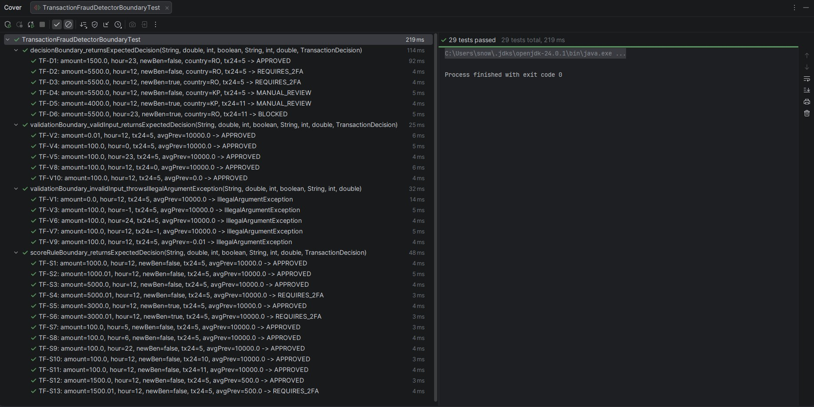
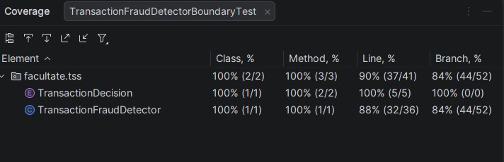
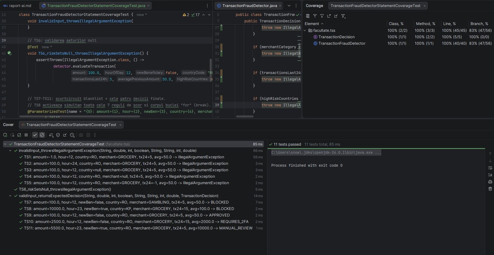
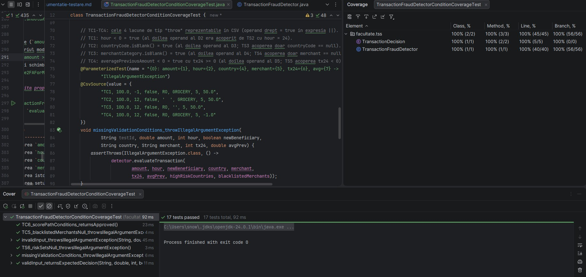
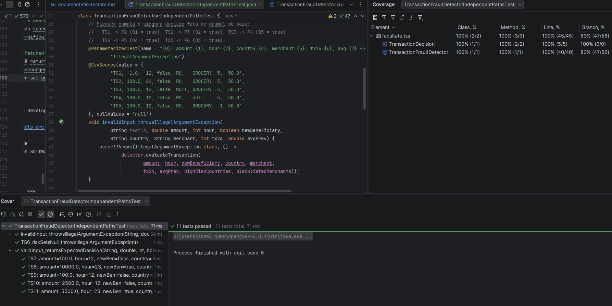
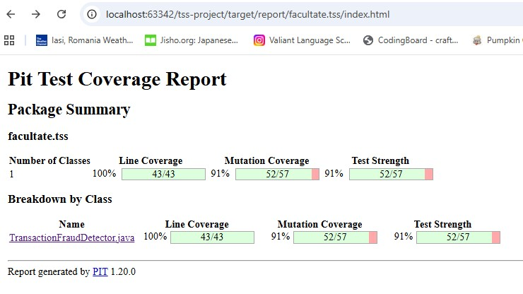
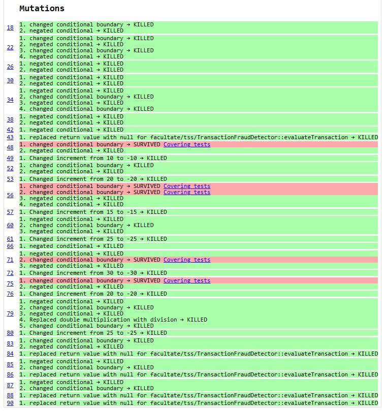
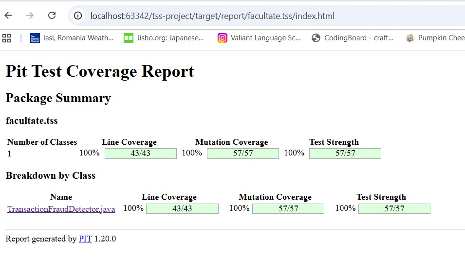
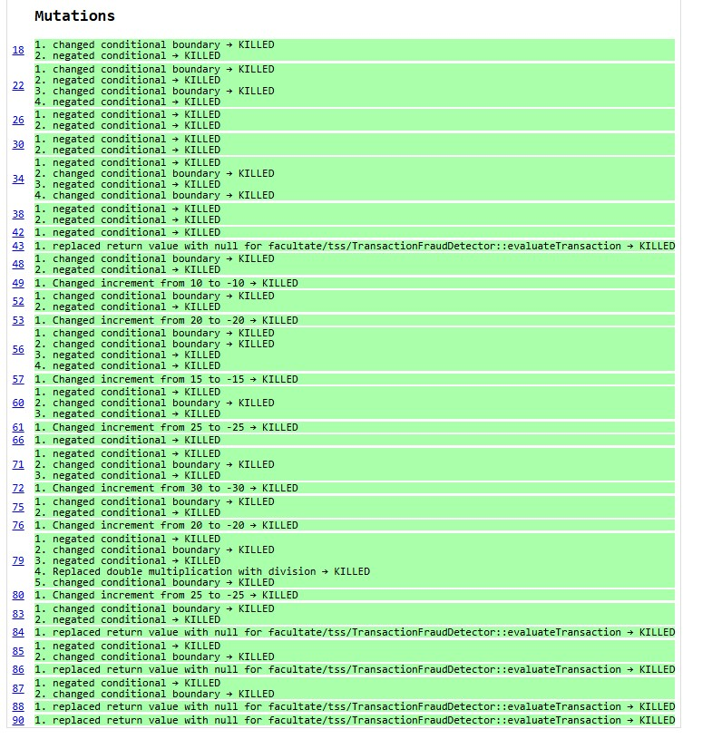

# Documentație testare

## Descriere generală

Aplicația implementează un **detector de fraudă pentru tranzacții bancare/card**. Pe baza datelor unei tranzacții și a
unor liste de risc, sistemul calculează un scor de risc și returnează o decizie privind procesarea tranzacției.

Componenta principală este clasa `facultate.tss.TransactionFraudDetector`, care expune metoda
`evaluateTransaction(...)`. Decizia returnată este de tipul `facultate.tss.TransactionDecision`.

## Specificația programului

### Intrări

Metoda `evaluateTransaction` primește următorii parametri:

| # | Parametru               | Tip           | Descriere                                                            | Constrângeri            |
|---|-------------------------|---------------|----------------------------------------------------------------------|-------------------------|
| 1 | `amount`                | `double`      | Suma tranzacției                                                     | Strict pozitivă (`> 0`) |
| 2 | `hourOfDay`             | `int`         | Ora la care s-a efectuat tranzacția                                  | În intervalul `[0, 23]` |
| 3 | `newBeneficiary`        | `boolean`     | `true` dacă beneficiarul nu a mai apărut în istoricul utilizatorului | &ndash;                 |
| 4 | `countryCode`           | `String`      | Codul țării în care se efectuează tranzacția                         | Non-null, non-blank     |
| 5 | `merchantCategory`      | `String`      | Categoria comerciantului                                             | Non-null, non-blank     |
| 6 | `transactionsLast24h`   | `int`         | Numărul de tranzacții efectuate în ultimele 24 de ore                | `>= 0`                  |
| 7 | `averagePreviousAmount` | `double`      | Media sumelor tranzacțiilor anterioare                               | `>= 0`                  |
| 8 | `highRiskCountries`     | `Set<String>` | Setul codurilor de țară considerate cu risc ridicat                  | Non-null (poate fi gol) |
| 9 | `blacklistedMerchants`  | `Set<String>` | Setul categoriilor de comercianți blocate                            | Non-null (poate fi gol) |

### Validări (excepții)

Metoda aruncă `IllegalArgumentException` în următoarele situații:

- `amount <= 0`
- `hourOfDay < 0` sau `hourOfDay > 23`
- `countryCode` este `null` sau blank
- `merchantCategory` este `null` sau blank
- `transactionsLast24h < 0` sau `averagePreviousAmount < 0`
- `highRiskCountries` sau `blacklistedMerchants` este `null`

### Reguli de decizie

1. **Blocare imediată**: dacă `merchantCategory` este în `blacklistedMerchants`, decizia este `BLOCKED`, fără calcul de
   scor.
2. Altfel, se calculează un **scor de risc** (`riskScore`), inițial `0`, prin însumarea punctelor:
    - `+10` dacă `amount > 1000`
    - `+20` dacă `amount > 5000` (cumulativ cu regula precedentă)
    - `+15` dacă `hourOfDay < 6` sau `hourOfDay > 22` (tranzacții nocturne)
    - `+25` dacă `newBeneficiary == true` și `amount > 3000`
    - `+30` dacă `countryCode` este în `highRiskCountries` și `amount > 3000`
    - `+20` dacă `transactionsLast24h > 10`
    - `+25` dacă `averagePreviousAmount > 0` și `amount > 3 * averagePreviousAmount`

### Ieșiri

Pe baza scorului final, metoda returnează una dintre valorile enum-ului `TransactionDecision`:

- **`BLOCKED`** dacă `riskScore >= 90` (sau dacă `merchantCategory` este în blacklist).
- **`MANUAL_REVIEW`** dacă `60 <= riskScore < 90`.
- **`REQUIRES_2FA`** dacă `30 <= riskScore < 60`.
- **`APPROVED`** dacă `riskScore < 30`.

## Testare funcțională

Testarea funcțională (*black-box*) derivă cazurile de test exclusiv din specificația programului, fără a
inspecta codul sursă. Pentru `evaluateTransaction` am aplicat două tehnici complementare:

- **Partiționarea de echivalență** &ndash; împarte domeniul fiecărui parametru în clase echivalente
  comportamental și alege un reprezentant per clasă.
- **Analiza valorilor de frontieră** &ndash; exersează valorile aflate exact pe pragurile din specificație
  și la cel mai mic pas reprezentabil de partea cealaltă, unde apar mai des erorile de comparație.

### Partiționare de echivalență

#### Clase pentru date de intrare invalide

| Clasă | Condiție                       | Comportament așteptat |
|-------|--------------------------------|-----------------------|
| I1    | `amount <= 0`                  | excepție              |
| I2    | `hourOfDay < 0`                | excepție              |
| I3    | `hourOfDay > 23`               | excepție              |
| I4    | `countryCode == null`          | excepție              |
| I5    | `countryCode.isBlank()`        | excepție              |
| I6    | `merchantCategory == null`     | excepție              |
| I7    | `merchantCategory.isBlank()`   | excepție              |
| I8    | `transactionsLast24h < 0`      | excepție              |
| I9    | `averagePreviousAmount < 0`    | excepție              |
| I10   | `highRiskCountries == null`    | excepție              |
| I11   | `blacklistedMerchants == null` | excepție              |

#### Clase pentru date de intrare valide

Pentru fiecare parametru, domeniul valid se partiționează după pragurile/condițiile care influențează decizia (regulile
de scor sau scurtcircuitul prin blacklist).

| Clasă | Parametru               | Condiție                                                             | Efect asupra deciziei                                         |
|-------|-------------------------|----------------------------------------------------------------------|---------------------------------------------------------------|
| V1    | `amount`                | `0 < amount <= 1000`                                                 | nu adaugă puncte din pragurile de sumă                        |
| V2    | `amount`                | `1000 < amount <= 3000`                                              | `+10` din pragul `>1000`                                      |
| V3    | `amount`                | `3000 < amount <= 5000`                                              | `+10` și activează regulile cu prag `>3000`                   |
| V4    | `amount`                | `amount > 5000`                                                      | `+10` și `+20` și activează regulile cu prag `>3000`          |
| V5    | `hourOfDay`             | `0 <= hourOfDay <= 5`                                                | `+15` (interval nocturn de jos)                               |
| V6    | `hourOfDay`             | `6 <= hourOfDay <= 22`                                               | `0` (interval diurn)                                          |
| V7    | `hourOfDay`             | `hourOfDay == 23`                                                    | `+15` (interval nocturn de sus)                               |
| V8    | `newBeneficiary`        | `true`                                                               | activează regula `+25 dacă amount > 3000`                     |
| V9    | `newBeneficiary`        | `false`                                                              | regula este inactivă                                          |
| V10   | `countryCode`           | `countryCode ∈ highRiskCountries`                                    | activează regula `+30 dacă amount > 3000`                     |
| V11   | `countryCode`           | `countryCode ∉ highRiskCountries` (non-blank)                        | regula este inactivă                                          |
| V12   | `merchantCategory`      | `merchantCategory ∈ blacklistedMerchants`                            | scurtcircuit: returnează `BLOCKED` fără calcul de scor        |
| V13   | `merchantCategory`      | `merchantCategory ∉ blacklistedMerchants` (non-blank)                | continuă cu calculul scorului                                 |
| V14   | `transactionsLast24h`   | `0 <= transactionsLast24h <= 10`                                     | `0`                                                           |
| V15   | `transactionsLast24h`   | `transactionsLast24h > 10`                                           | `+20`                                                         |
| V16   | `averagePreviousAmount` | `averagePreviousAmount == 0`                                         | regula multiplului dezactivată (`> 0` este parte din premisă) |
| V17   | `averagePreviousAmount` | `averagePreviousAmount > 0` și `amount <= 3 * averagePreviousAmount` | regula multiplului inactivă                                   |
| V18   | `averagePreviousAmount` | `averagePreviousAmount > 0` și `amount > 3 * averagePreviousAmount`  | `+25`                                                         |

**Observație.** Parametrii `highRiskCountries` și `blacklistedMerchants` sunt acoperiți implicit prin clasele de
membership V10–V13. Cazurile **set gol** sunt subcazuri reprezentative ale V11 (respectiv V13), iar **set ne-gol care
conține valoarea** corespund V10 (respectiv V12).

#### Clase pentru date de ieșire

Domeniul de ieșire este enum-ul `TransactionDecision`. Partiționarea reflectă atât valoarea returnată, cât și calea prin
care este produsă (pentru `BLOCKED` există două căi distincte).

| Clasă | Decizie         | Condiție declanșatoare                                                             |
|-------|-----------------|------------------------------------------------------------------------------------|
| O1    | `APPROVED`      | `merchantCategory ∉ blacklistedMerchants` și `riskScore < 30`                      |
| O2    | `REQUIRES_2FA`  | `merchantCategory ∉ blacklistedMerchants` și `30 <= riskScore < 60`                |
| O3    | `MANUAL_REVIEW` | `merchantCategory ∉ blacklistedMerchants` și `60 <= riskScore < 90`                |
| O4    | `BLOCKED`       | `merchantCategory ∉ blacklistedMerchants` și `riskScore >= 90` (blocare prin scor) |
| O5    | `BLOCKED`       | `merchantCategory ∈ blacklistedMerchants` (scurtcircuit, fără calcul de scor)      |

#### Setul minimal de teste prin partiționare de echivalență

**Constante** folosite în toate testele:

- `highRiskCountries = {"KP", "IR", "MM"}` &ndash; coduri ISO 3166-1 alpha-2 pentru Coreea de Nord, Iran și Myanmar,
  țările aflate pe lista neagră FATF (*High-Risk Jurisdictions subject to a Call for Action*) [[1]](#bibliografie).
- `blacklistedMerchants = {"GAMBLING", "CRYPTO_EXCHANGE", "FIREARMS"}`

**Valori baseline valide** (folosite în testele invalide pentru parametrii nemodificați):

- `amount = 100.0`, `hourOfDay = 11`, `newBeneficiary = false`, `countryCode = "RO"`,
  `merchantCategory = "GROCERY STORES"`,
  `transactionsLast24h = 5`, `averagePreviousAmount = 50.0`

#### Teste pentru clase invalide

| Test | Clasă | Parametru modificat               | Rezultat așteptat          |
|------|-------|-----------------------------------|----------------------------|
| TI1  | I1    | `amount = -100`                   | `IllegalArgumentException` |
| TI2  | I2    | `hourOfDay = -10`                 | `IllegalArgumentException` |
| TI3  | I3    | `hourOfDay = 26`                  | `IllegalArgumentException` |
| TI4  | I4    | `countryCode = null`              | `IllegalArgumentException` |
| TI5  | I5    | `countryCode = "  "`              | `IllegalArgumentException` |
| TI6  | I6    | `merchantCategory = null`         | `IllegalArgumentException` |
| TI7  | I7    | `merchantCategory = ""`           | `IllegalArgumentException` |
| TI8  | I8    | `transactionsLast24h = -3`        | `IllegalArgumentException` |
| TI9  | I9    | `averagePreviousAmount = -1000.0` | `IllegalArgumentException` |
| TI10 | I10   | `highRiskCountries = null`        | `IllegalArgumentException` |
| TI11 | I11   | `blacklistedMerchants = null`     | `IllegalArgumentException` |

#### Teste pentru clase valide (acoperă și clasele de ieșire)

| Test | Clase de intrare acoperite     | `amount` | `hour` | `newBen` | `country` | `merchant`                        | `tx24` | `avgPrev` | Ieșire | Rezultat așteptat           |
|------|--------------------------------|----------|--------|----------|-----------|-----------------------------------|--------|-----------|--------|-----------------------------|
| TV1  | V1, V6, V9, V11, V13, V14, V16 | 70       | 11     | false    | "RO"      | "GROCERY STORES"                  | 5      | 0.0       | O1     | `APPROVED` (scor `0`)       |
| TV2  | V2, V5, V9, V11, V13, V15, V17 | 2500     | 3      | false    | "RO"      | "DENTAL AND MEDICAL LABORATORIES" | 15     | 1000.0    | O2     | `REQUIRES_2FA` (scor `45`)  |
| TV3  | V3, V7, V8, V10, V13, V14, V17 | 4000     | 23     | true     | "KP"      | "SHOE STORES"                     | 5      | 2000.0    | O3     | `MANUAL_REVIEW` (scor `80`) |
| TV4  | V4, V6, V8, V10, V13, V15, V18 | 6000     | 12     | true     | "IR"      | "GROCERY STORES"                  | 15     | 1000.0    | O4     | `BLOCKED` prin scor (`130`) |
| TV5  | V1, V6, V9, V11, V12, V14, V17 | 500      | 12     | false    | "RO"      | "GAMBLING"                        | 5      | 200.0     | O5     | `BLOCKED` prin blacklist    |

#### Rularea testelor

Cele 16 teste din clasa `TransactionFraudDetectorEquivalenceTest` (11 invalide + 5 valide) trec integral:


#### Acoperire

Acoperirea a fost măsurată cu runner-ul IntelliJ IDEA, după rularea exclusivă a suitei de partiționare de echivalență:


##### Interpretare

- **Acoperire pe linii / instrucțiuni: 100%** &ndash; toate liniile metodei `evaluateTransaction` sunt executate de
  setul minimal de teste.
- **Acoperire pe ramuri: sub 100%** &ndash; rămân neacoperite două ramuri în condițiile compuse cu `&&`:


```
if (newBeneficiary && amount > 3000) {...}
if (isHighRiskCountry && amount > 3000) {...}
```

În ambele cazuri lipsește subcombinația "operand stâng `true`, operand drept `false`", adică:

- `newBeneficiary == true` și `amount <= 3000`
- `countryCode ∈ highRiskCountries` și `amount <= 3000`

Motivul este metodologic, nu o deficiență a partiționării. Tehnica de partiționare de echivalență este una
**black-box**: clasele se derivă din specificație, iar specificația tratează cele două reguli de scor ca pe niște
condiții atomice (se aplică doar dacă ambele premise sunt adevărate). Nu există în specificație o partiție
naturală pentru subcazul "premisa secundară falsă", deoarece comportamentul observabil este identic cu al cazului în
care premisa primară este falsă (regula nu se aplică, scorul rămâne neschimbat).

Acoperirea completă pe ramuri se poate obține complementar, prin testare **white-box** (acoperire la nivel de ramură).

### Analiza valorilor de frontieră

Testarea valorilor de frontieră (*Boundary Value Analysis*, BVA) completează partiționarea în clase de echivalență prin
selectarea de date de test care exersează marginile fiecărui interval valid sau invalid și punctele de
comutare ale regulilor de decizie. Defectele tipice care apar în pragul condițiilor (valoare diferită cu o
unitate față de prag, `<` vs `<=`) sunt
descoperite cu probabilitate maximă atunci când datele de test cad exact pe valorile de frontieră sau la cel mai mic
pas reprezentabil de o parte sau de alta a acestora.

#### Frontiere identificate

Din specificația programului se desprind trei categorii de frontiere.

**(F&#8209;V) Frontiere de validare** &ndash; capetele domeniului valid pentru fiecare parametru numeric (excepția se
aruncă strict în afara acestui domeniu):

| Parametru               | Limită inferioară valabilă | Limită superioară valabilă |
|-------------------------|----------------------------|----------------------------|
| `amount`                | `> 0` (excluziv)           | &ndash; (nemărginit)       |
| `hourOfDay`             | `0` (incluziv)             | `23` (incluziv)            |
| `transactionsLast24h`   | `0` (incluziv)             | &ndash; (nemărginit)       |
| `averagePreviousAmount` | `0` (incluziv)             | &ndash; (nemărginit)       |

**(F&#8209;S) Frontiere ale regulilor de scor** &ndash; pragurile la care se comută regulile aditive (toate sunt
formulate cu inegalitate strictă `>`, deci frontiera însăși nu activează regula):

| Regulă                                            | Prag          | Tip operator |
|---------------------------------------------------|---------------|--------------|
| `amount > 1000`                                   | `1000`        | `>`          |
| `amount > 5000`                                   | `5000`        | `>`          |
| `amount > 3000` (combinat cu `newBeneficiary`)    | `3000`        | `>`          |
| `amount > 3000` (combinat cu `highRiskCountries`) | `3000`        | `>`          |
| `hourOfDay < 6`                                   | `6`           | `<`          |
| `hourOfDay > 22`                                  | `22`          | `>`          |
| `transactionsLast24h > 10`                        | `10`          | `>`          |
| `averagePreviousAmount > 0`                       | `0`           | `>`          |
| `amount > 3 * averagePreviousAmount`              | `3 · avgPrev` | `>`          |

**(F&#8209;D) Frontiere ale deciziilor** &ndash; capetele și pragurile interne ale domeniului `riskScore`. Pragurile de
tranziție sunt formulate cu `>=`, deci frontiera însăși trece în clasa de risc superioară. La capătul inferior al
domeniului se află scorul `0` (interior clasei `APPROVED`), atins când niciuna dintre regulile aditive nu se aplică,
iar prima valoare nenulă realizabilă este `10` (incrementul minim al regulilor: `amount > 1000`):

| Tip frontieră                                           | Valoare | Comentariu                                                             |
|---------------------------------------------------------|---------|------------------------------------------------------------------------|
| Limită inferioară a domeniului `riskScore`              | `0`     | scor minim când nicio regulă aditivă nu se activează; clasa `APPROVED` |
| Prag de tranziție `APPROVED` &rarr; `REQUIRES_2FA`      | `30`    | comparație `>=`                                                        |
| Prag de tranziție `REQUIRES_2FA` &rarr; `MANUAL_REVIEW` | `60`    | comparație `>=`                                                        |
| Prag de tranziție `MANUAL_REVIEW` &rarr; `BLOCKED`      | `90`    | comparație `>=`                                                        |

#### Setul minimal de teste de frontieră

Pentru fiecare frontieră se generează două teste: unul **chiar pe valoarea frontierei** și unul **la cel mai mic pas
reprezentabil de partea cealaltă**. Pentru variabile `int` pasul este `±1`; pentru sume monetare `double` este
`±0.01` (cea mai mică unitate semnificativă pentru o monedă). Frontierele care implică condiții logice `&&`
(de exemplu, `newBeneficiary && amount > 3000`) sunt testate cu cealaltă premisă fixată pe `true`, pentru ca regula să
poată comuta în funcție de `amount`.

Tabelele din această secțiune sumarizează datele de test esențiale (variabila pe frontieră, valoarea, caracterizarea și
rezultatul așteptat). Specificațiile complete sunt prezentate în [Anexa A: Tabel detaliat al testelor de analiză
de frontieră](anexa-a-teste-frontiera.md).

**Constante** (identice cu cele din partiționarea în clase de echivalență):

- `highRiskCountries = {"KP", "IR", "MM"}`, `blacklistedMerchants = {"GAMBLING", "CRYPTO_EXCHANGE", "FIREARMS"}`.

**Baseline neutru** (valorile parametrilor nemodificați; produc `riskScore = 0` &rarr; `APPROVED`):

- `amount = 100.0`, `hourOfDay = 12`, `newBeneficiary = false`, `countryCode = "RO"`,
  `merchantCategory = "GROCERY STORES"`, `transactionsLast24h = 5`, `averagePreviousAmount = 10000.0`.

`averagePreviousAmount` este intenționat mare (`10000`) pentru ca regula `amount > 3 · avgPrev` să nu se activeze
accidental atunci când variem `amount`. Pentru testele dedicate acestei reguli, `avgPrev` se redefinește local la
`500.0`.

##### Frontiere de validare (F&#8209;V)

| Test         | Variabilă pe frontieră  | Valoare | Caracterizare                                     | Rezultat așteptat                      |
|--------------|-------------------------|---------|---------------------------------------------------|----------------------------------------|
| TF&#8209;V1  | `amount`                | `0.0`   | chiar sub frontiera validă                        | `IllegalArgumentException`             |
| TF&#8209;V2  | `amount`                | `0.01`  | cea mai mică valoare validă                       | `APPROVED` (scor `0`)                  |
| TF&#8209;V3  | `hourOfDay`             | `-1`    | sub limita inferioară                             | `IllegalArgumentException`             |
| TF&#8209;V4  | `hourOfDay`             | `0`     | limită inferioară valabilă                        | `APPROVED` (scor `15`, nocturn de jos) |
| TF&#8209;V5  | `hourOfDay`             | `23`    | limită superioară valabilă                        | `APPROVED` (scor `15`, nocturn de sus) |
| TF&#8209;V6  | `hourOfDay`             | `24`    | peste limita superioară                           | `IllegalArgumentException`             |
| TF&#8209;V7  | `transactionsLast24h`   | `-1`    | sub limita inferioară                             | `IllegalArgumentException`             |
| TF&#8209;V8  | `transactionsLast24h`   | `0`     | limită inferioară valabilă                        | `APPROVED` (scor `0`)                  |
| TF&#8209;V9  | `averagePreviousAmount` | `-0.01` | sub limita inferioară                             | `IllegalArgumentException`             |
| TF&#8209;V10 | `averagePreviousAmount` | `0.0`   | limită inferioară; regula multiplului dezactivată | `APPROVED` (scor `0`)                  |

**Observație.** TF&#8209;V4 și TF&#8209;V5 acoperă simultan câte o frontieră (F&#8209;V) și câte una de scor
(F&#8209;S, regulile `< 6` și `> 22` se activează la aceste valori).

##### Frontiere ale regulilor de scor (F&#8209;S)

| Test         | Variabile pe frontieră          | Valori cheie | Caracterizare                                       | Scor așteptat | Rezultat așteptat |
|--------------|---------------------------------|--------------|-----------------------------------------------------|---------------|-------------------|
| TF&#8209;S1  | `amount`                        | `1000.0`     | `> 1000` NU se activează                            | `0`           | `APPROVED`        |
| TF&#8209;S2  | `amount`                        | `1000.01`    | `> 1000` se activează: `+10`                        | `10`          | `APPROVED`        |
| TF&#8209;S3  | `amount`                        | `5000.0`     | `> 5000` NU se activează; `> 1000` da               | `10`          | `APPROVED`        |
| TF&#8209;S4  | `amount`                        | `5000.01`    | `> 5000` se activează: `+10 + 20`                   | `30`          | `REQUIRES_2FA`    |
| TF&#8209;S5  | `amount`, `newBeneficiary=true` | `3000.0`     | regula `newBen && > 3000` NU se activează           | `10`          | `APPROVED`        |
| TF&#8209;S6  | `amount`, `newBeneficiary=true` | `3000.01`    | regula se activează: `+10 + 25`                     | `35`          | `REQUIRES_2FA`    |
| TF&#8209;S7  | `hourOfDay`                     | `5`          | `< 6` se activează: `+15`                           | `15`          | `APPROVED`        |
| TF&#8209;S8  | `hourOfDay`                     | `6`          | `< 6` NU se activează                               | `0`           | `APPROVED`        |
| TF&#8209;S9  | `hourOfDay`                     | `22`         | `> 22` NU se activează                              | `0`           | `APPROVED`        |
| TF&#8209;S10 | `transactionsLast24h`           | `10`         | `> 10` NU se activează                              | `0`           | `APPROVED`        |
| TF&#8209;S11 | `transactionsLast24h`           | `11`         | `> 10` se activează: `+20`                          | `20`          | `APPROVED`        |
| TF&#8209;S12 | `amount` cu `avgPrev=500.0`     | `1500.0`     | `amount > 3 · avgPrev` NU se activează; `> 1000` da | `10`          | `APPROVED`        |
| TF&#8209;S13 | `amount` cu `avgPrev=500.0`     | `1500.01`    | regula se activează: `+10 + 25`                     | `35`          | `REQUIRES_2FA`    |

Capătul inferior al domeniului `riskScore` (`0`, când nicio regulă nu se activează) și prima valoare nenulă realizabilă
(`10`, generată de regula `amount > 1000`) sunt acoperite implicit de **TF&#8209;V2** (`amount = 0.01`, scor `0`) și
**TF&#8209;S2** (`amount = 1000.01`, scor `10`); ambele teste produc decizia `APPROVED`.

**Observație.** Frontiera `amount > 3000` cu `highRiskCountries.contains(countryCode)` este simetrică cu cea testată în
TF&#8209;S5/S6 (același prag, același tip de operator, regulă activată cu `+30` în loc de `+25`); o testăm implicit în
testele de prag de decizie de mai jos (TF&#8209;D4, TF&#8209;D6).

##### Frontiere ale deciziilor (F&#8209;D)

Pragurile `30`, `60`, `90` se compară cu `>=`, deci frontiera însăși *trece* în clasa superioară. Deoarece toate
incrementele de scor sunt multipli de 5, valorile imediat sub praguri sunt `25`, `55`, `85` (cele mai mari scoruri
reprezentabile sub fiecare prag).

| Test        | Combinație de reguli activate                                                                     | Scor calculat | Caracterizare       | Rezultat așteptat |
|-------------|---------------------------------------------------------------------------------------------------|---------------|---------------------|-------------------|
| TF&#8209;D1 | `amount = 1500` (`+10`) + `hour = 23` (`+15`)                                                     | `25`          | sub pragul `30`     | `APPROVED`        |
| TF&#8209;D2 | `amount = 5500` (`+10 + 20`)                                                                      | `30`          | egal cu pragul `30` | `REQUIRES_2FA`    |
| TF&#8209;D3 | `amount = 5500` + `newBeneficiary = true` (`+10 + 20 + 25`)                                       | `55`          | sub pragul `60`     | `REQUIRES_2FA`    |
| TF&#8209;D4 | `amount = 5500` + `countryCode = "KP"` (`+10 + 20 + 30`)                                          | `60`          | egal cu pragul `60` | `MANUAL_REVIEW`   |
| TF&#8209;D5 | `amount = 4000` + `newBeneficiary = true` + `country = "KP"` + `tx24 = 11` (`+10 + 25 + 30 + 20`) | `85`          | sub pragul `90`     | `MANUAL_REVIEW`   |
| TF&#8209;D6 | `amount = 5500` + `newBeneficiary = true` + `hour = 23` + `tx24 = 11` (`+10 + 20 + 25 + 15 + 20`) | `90`          | egal cu pragul `90` | `BLOCKED`         |

**Sinteză.** Setul minimal cuprinde 29 teste: 10 pentru frontierele de validare (F&#8209;V), 13 pentru
frontierele regulilor de scor (F&#8209;S) și 6 pentru frontierele deciziilor (F&#8209;D). Spre comparație, suita de
partiționare de echivalență conține 16 teste; creșterea este intrinsecă tehnicii BVA, care necesită câte două teste
(unul chiar pe prag și unul la pasul minim de cealaltă parte) pentru fiecare prag identificat în specificație.

**Precizări**
Câteva verificări nu intră în analiza valorilor de frontieră pentru că nu definesc o frontieră numerică, dar sunt
acoperite în testele cu clase de echivalență:

- **`blacklistedMerchants.contains(merchantCategory)`** &ndash; apartenență la o mulțime de string-uri
  (scurtcircuit imediat la `BLOCKED`); nicio valoare "imediat sub/peste".
- **Validările `null` / blank** pentru `countryCode` și `merchantCategory` &ndash; clase discrete (`null`, blank, șir
  valid), fără valori intermediare.
- **`newBeneficiary`** și **apartenența `countryCode ∈ highRiskCountries`** &ndash; valori discrete (boolean, respectiv
  apartenență la mulțime). Apar în BVA doar **ca premisă fixată** în regulile compuse `&& amount > 3000`, unde
  frontiera testată este pe `amount` (TF&#8209;S5/S6 pentru `newBeneficiary`, TF&#8209;D4/D6 pentru `countryCode`).

#### Rularea testelor

Cele 29 de teste din clasa `TransactionFraudDetectorBoundaryTest` (5 F&#8209;V invalide, 5 F&#8209;V valide, 13
F&#8209;S și 6 F&#8209;D) trec integral:



#### Acoperire

Acoperirea a fost măsurată cu runner-ul IntelliJ IDEA, după rularea exclusivă a suitei BVA:



##### Interpretare

- **Acoperire pe clase / metode: 100%** &ndash; toate clasele și metodele din `facultate.tss` sunt atinse.
- **Acoperire pe linii: 90% (37/41)** &ndash; cele patru linii neacoperite corespund exact predicatelor enumerate în
  *"Precizări"*: validările `null` / blank pentru `countryCode` și `merchantCategory`, validarea seturilor `null` și
  scurtcircuitul prin blacklist. Nu sunt frontiere numerice, deci ies din sfera BVA; sunt acoperite însă de
  suita complementară `TransactionFraudDetectorEquivalenceTest`.
- **Acoperire pe ramuri: 84% (44/52)** &ndash; aceleași patru predicate categoriale plus o parte din subramurile
  `&&` al regulilor compuse de scor. Notabil: **TF&#8209;S5** (`newBeneficiary = true`, `amount = 3000`) exersează
  combinația `true && false` din regula `newBeneficiary && amount > 3000` &ndash; subramură pe care suita EP nu o
  acoperea. Simetrica pe regula `(countryCode ∈ highRiskCountries) && amount > 3000` rămâne neacoperită, neavând
  test care să combine o țară din `highRiskCountries` cu `amount ≤ 3000` (combinația nu corespunde unei frontiere pe
  `amount`).
- Cele două suite (BVA și EP) împreună acoperă toate liniile și majoritatea ramurilor exercitabile
  black-box. Subramurile `&&` rămase pot fi atinse complet doar prin testare white-box.

## Testare structurală

Testarea structurală (*white-box*) folosește structura internă a codului (secvența de instrucțiuni,
ramurile decizionale, fluxul de control) pentru a deriva cazurile de test și pentru a măsura acoperirea
obținută. Spre deosebire de testarea funcțională, aici criteriile sunt cuantificabile: acoperire la nivel
de instrucțiune, ramură, condiție / decizie, cale.

### Graful fluxului de control

Graful fluxului de control (*Control Flow Graph*, CFG) al metodei `evaluateTransaction` a fost construit cu
utilitarul [code2flow](https://app.code2flow.com/) și este disponibil în
[`screenshots/graf-flux-control/code2flow_8JTB2i.pdf`](screenshots/graf-flux-control/code2flow_8JTB2i.pdf).
Graful evidențiază:

- cele șase blocuri de validare cu ieșire prin excepție (`throw`);
- scurtcircuitul prin blacklist (`return BLOCKED`);
- bucla `for` peste `highRiskCountries`, cu ramura de potrivire (`break`);
- cele șapte reguli aditive de scor;
- cele patru returnuri finale, ramificate pe pragurile `30 / 60 / 90`.

Reprezentarea CFG stă la baza derivării cazurilor de test pentru fiecare criteriu structural.

### Setul minimal de teste pentru acoperirea la nivel de instrucțiune

Acoperirea la nivel de instrucțiune (*statement coverage*) cere ca fiecare instrucțiune executabilă din
metodă să fie atinsă de cel puțin un test din suită. Pentru `evaluateTransaction`, instrucțiunile care nu pot
fi acoperite în treacăt și impun teste dedicate sunt:

- cele 6 instrucțiuni `throw` &ndash; câte una pentru fiecare bloc de validare; fiecare se execută doar pe
  o cale care părăsește imediat metoda;
- `return TransactionDecision.BLOCKED` din scurtcircuitul prin blacklist;
- corpul buclei `for` (`isHighRiskCountry = true; break;`) &ndash; se execută doar dacă `countryCode` apare
  efectiv în `highRiskCountries`;
- cele șapte instrucțiuni `riskScore += ...` &ndash; toate trebuie executate cel puțin o dată;
- cele patru `return`-uri finale (`BLOCKED`, `MANUAL_REVIEW`, `REQUIRES_2FA`, `APPROVED`).

Combinând aceste cerințe, setul minimal este de **11 teste**: 6 pentru excepții, 1 pentru scurtcircuitul prin
blacklist și 4 pentru deciziile finale &mdash; dintre care unul (TS8) activează simultan toate cele șapte
reguli de scor și ramura de potrivire din bucla `for`.

Constante folosite în toate testele (identice cu cele din suita de partiționare):

- `highRiskCountries = {"KP", "IR", "MM"}`
- `blacklistedMerchants = {"GAMBLING", "CRYPTO_EXCHANGE", "FIREARMS"}`

| Test | Instrucțiuni țintă                                                      | `amount` | `hour` | `newBen` | `country` | `merchant`   | `tx24` | `avgPrev` | Rezultat așteptat                                       |
|------|-------------------------------------------------------------------------|----------|--------|----------|-----------|--------------|--------|-----------|---------------------------------------------------------|
| TS1  | `throw` din validarea `amount`                                          | `-1`     | `12`   | `false`  | `"RO"`    | `"GROCERY"`  | `5`    | `50.0`    | `IllegalArgumentException`                              |
| TS2  | `throw` din validarea `hourOfDay`                                       | `100`    | `24`   | `false`  | `"RO"`    | `"GROCERY"`  | `5`    | `50.0`    | `IllegalArgumentException`                              |
| TS3  | `throw` din validarea `countryCode`                                     | `100`    | `12`   | `false`  | `null`    | `"GROCERY"`  | `5`    | `50.0`    | `IllegalArgumentException`                              |
| TS4  | `throw` din validarea `merchantCategory`                                | `100`    | `12`   | `false`  | `"RO"`    | `null`       | `5`    | `50.0`    | `IllegalArgumentException`                              |
| TS5  | `throw` din validarea istoricului (`tx24` / `avg`)                      | `100`    | `12`   | `false`  | `"RO"`    | `"GROCERY"`  | `-1`   | `50.0`    | `IllegalArgumentException`                              |
| TS6  | `throw` din validarea seturilor `null`                                  | `100`    | `12`   | `false`  | `"RO"`    | `"GROCERY"`  | `5`    | `50.0`    | `IllegalArgumentException` (`highRiskCountries = null`) |
| TS7  | `return BLOCKED` din scurtcircuitul blacklist                           | `100`    | `12`   | `false`  | `"RO"`    | `"GAMBLING"` | `5`    | `50.0`    | `BLOCKED` (scurtcircuit)                                |
| TS8  | toate `riskScore += ...` + corpul `for` (`break`) + `BLOCKED` prin scor | `10000`  | `23`   | `true`   | `"KP"`    | `"GROCERY"`  | `15`   | `100.0`   | `BLOCKED` (scor `145`)                                  |
| TS9  | `return APPROVED` (loop iterat fără potrivire)                          | `100`    | `12`   | `false`  | `"RO"`    | `"GROCERY"`  | `5`    | `50.0`    | `APPROVED` (scor `0`)                                   |
| TS10 | `return REQUIRES_2FA`                                                   | `2500`   | `12`   | `false`  | `"RO"`    | `"GROCERY"`  | `15`   | `2000.0`  | `REQUIRES_2FA` (scor `30`)                              |
| TS11 | `return MANUAL_REVIEW`                                                  | `5500`   | `23`   | `true`   | `"RO"`    | `"GROCERY"`  | `5`    | `10000.0` | `MANUAL_REVIEW` (scor `70`)                             |

#### Rularea testelor și acoperire

Cele 11 teste din clasa `TransactionFraudDetectorStatementCoverageTest` trec integral.
Acoperirea a fost măsurată cu runner-ul IntelliJ IDEA, după rularea exclusivă a acestei suite:



##### Interpretare

- **Acoperire pe clase / metode: 100%** &ndash; toate clasele și metodele din pachetul `facultate.tss` sunt
  atinse.
- **Acoperire pe linii / instrucțiuni: 100% (40/40)** pentru `TransactionFraudDetector` &ndash; obiectivul
  criteriului *statement coverage* este atins în întregime de setul minimal de 11 teste. Fiecare instrucțiune
  executabilă a metodei `evaluateTransaction` este atinsă de cel puțin un test, conform tabelului de mai sus.
- Diferența până la 100% pe ramuri este intrinsecă diferenței dintre criterii: pentru acoperirea completă pe
  ramuri ar fi necesare câteva teste adiționale.

### Setul minimal de teste pentru acoperirea la nivel de decizie (ramură)

Acoperirea la nivel de decizie cere ca pentru fiecare decizie din program (orice expresie booleană care controlează
fluxul de execuție) să se testeze ambele rezultate - `true` și `false`. Pentru deciziile compuse cu operatori `&&` /
`||`, criteriul nu impune evaluarea separată a fiecărei sub-condiții, ci doar a rezultatului global al expresiei.

#### Inventarul deciziilor

Din graful de flux de control al metodei `evaluateTransaction` se pot observa 19 decizii, deci 38 de ramuri de
acoperit:

| ID  | Decizie                                                       | Ramura `true`               | Ramura `false`        |
|-----|---------------------------------------------------------------|-----------------------------|-----------------------|
| D1  | `amount <= 0`                                                 | `throw`                     | continuă              |
| D2  | `hourOfDay < 0 \|\| hourOfDay > 23`                           | `throw`                     | continuă              |
| D3  | `countryCode == null \|\| countryCode.isBlank()`              | `throw`                     | continuă              |
| D4  | `merchantCategory == null \|\| merchantCategory.isBlank()`    | `throw`                     | continuă              |
| D5  | `transactionsLast24h < 0 \|\| averagePreviousAmount < 0`      | `throw`                     | continuă              |
| D6  | `highRiskCountries == null \|\| blacklistedMerchants == null` | `throw`                     | continuă              |
| D7  | `blacklistedMerchants.contains(merchantCategory)`             | `return BLOCKED`            | continuă              |
| D8  | `amount > 1000`                                               | `riskScore += 10`           | sare peste            |
| D9  | `amount > 5000`                                               | `riskScore += 20`           | sare peste            |
| D10 | `hourOfDay < 6 \|\| hourOfDay > 22`                           | `riskScore += 15`           | sare peste            |
| D11 | `newBeneficiary && amount > 3000`                             | `riskScore += 25`           | sare peste            |
| D12 | `for` peste `highRiskCountries` (intrarea în bloc)            | execută bloc                | iese normal din buclă |
| D13 | `country.equals(countryCode)` (în blocul `for`)               | `isHighRisk = true; break;` | continuă iterația     |
| D14 | `isHighRiskCountry && amount > 3000`                          | `riskScore += 30`           | sare peste            |
| D15 | `transactionsLast24h > 10`                                    | `riskScore += 20`           | sare peste            |
| D16 | `averagePreviousAmount > 0 && amount > avgPrev * 3`           | `riskScore += 25`           | sare peste            |
| D17 | `riskScore >= 90`                                             | `return BLOCKED`            | continuă              |
| D18 | `riskScore >= 60`                                             | `return MANUAL_REVIEW`      | continuă              |
| D19 | `riskScore >= 30`                                             | `return REQUIRES_2FA`       | `return APPROVED`     |

#### Setul minimal

Cardinalitatea minimă a suitei pentru acoperirea la nivel de ramură este determinată de aceleași constrângeri ca la
acoperirea la nivel de instrucțiune:

- D1&ndash;D6 cu rezultatul `true` impun 6 teste distincte (fiecare excepție părăsește metoda imediat);
- D7 cu rezultatul `true` cere 1 test dedicat (scurtcircuitul prin blacklist returnează înainte de orice
  decizie ulterioară);
- D17, D18 și D19 partiționează scorul în patru clase disjuncte (`< 30`, `[30, 60)`, `[60, 90)`, `≥ 90`),
  fiecare cerând câte un test propriu pentru ca atât ramurile `true`, cât și `false` ale celor trei comparații
  succesive să fie acoperite.

În total: 6 + 1 + 4 = **11 teste**. Restul deciziilor (D8&ndash;D16) sunt acoperite în treacăt de aceste 11 teste,
fără a impune cardinalitate suplimentară. Mai mult, același set TS1&ndash;TS11 definit pentru acoperirea la nivel de
instrucțiune satisface integral și acoperirea la nivel de decizie, prin construcție: testele acoperă cele 4 clase de
scor și fiecare ramură `if`-`else` din metodă, iar TS8 (cu toate cele 7 reguli aditive activate, `country = "KP"`
și `amount = 10000`) împreună cu TS9&ndash;TS11 (cu `country = "RO"`, nicio potrivire în buclă) acoperă atât
ramura `true` (potrivire + `break`), cât și ramura `false` (parcurgere completă fără potrivire) ale buclei
`for` și ale deciziei interne `country.equals(countryCode)`.

#### Trasabilitate decizie &harr; test

Tabelul de mai jos confirmă că fiecare ramură a fiecărei decizii este exersată de cel puțin un test
din TS1&ndash;TS11:

| Decizie | Test(e) pentru ramura `true`              | Test(e) pentru ramura `false`             |
|---------|-------------------------------------------|-------------------------------------------|
| D1      | TS1                                       | TS2&ndash;TS11                            |
| D2      | TS2                                       | TS3&ndash;TS11                            |
| D3      | TS3                                       | TS4&ndash;TS11                            |
| D4      | TS4                                       | TS5&ndash;TS11                            |
| D5      | TS5                                       | TS6&ndash;TS11                            |
| D6      | TS6                                       | TS7&ndash;TS11                            |
| D7      | TS7                                       | TS8&ndash;TS11                            |
| D8      | TS8, TS10, TS11                           | TS9                                       |
| D9      | TS8, TS11                                 | TS9, TS10                                 |
| D10     | TS8, TS11 (`hour = 23`)                   | TS9, TS10 (`hour = 12`)                   |
| D11     | TS8, TS11 (`newBen = true`, `amt > 3000`) | TS9, TS10 (`newBen = false`)              |
| D12     | TS8&ndash;TS11 (intră în bloc)            | TS9&ndash;TS11 (ies normal, fără `break`) |
| D13     | TS8 (la iterația cu `KP`)                 | TS9&ndash;TS11 (toate iterațiile cu `RO`) |
| D14     | TS8 (`isHighRisk = true`, `amt > 3000`)   | TS9&ndash;TS11 (`isHighRisk = false`)     |
| D15     | TS8, TS10 (`tx24 = 15`)                   | TS9, TS11 (`tx24 = 5`)                    |
| D16     | TS8 (`amt > 3 · avg`)                     | TS9, TS10, TS11                           |
| D17     | TS8 (scor `145`)                          | TS9, TS10, TS11                           |
| D18     | TS11 (scor `70`)                          | TS9, TS10                                 |
| D19     | TS10 (scor `30`)                          | TS9 (scor `0`)                            |

Pentru metoda `evaluateTransaction`, criteriul de acoperire la nivel de decizie nu impune teste suplimentare față
de acoperirea la nivel de instrucțiune; cele 11 teste TS1&ndash;TS11 satisfac simultan ambele criterii, iar
clasa `TransactionFraudDetectorStatementCoverageTest` poate fi reutilizată ca atare pentru verificarea
acoperirii la nivel de decizie.

> **Observație** Coloana *Branch %* raportată de IntelliJ IDEA pentru această suită
> (83% &ndash; vezi sub-secțiunea anterioară) nu corespunde criteriului de acoperire definit aici,
> ci unei variante mai stricte care contorizează separat sub-evaluările atomice ale operanzilor `&&` și `||`
> (apropiată de acoperirea la nivel de condiție). Cele 9 sub-ramuri rămase neacoperite (`56 - 47`) se află exact pe
> sub-condițiile compuse, de exemplu `newBeneficiary = true && amount ≤ 3000` din D11 sau `hour < 6 = true`
> din D10 &ndash; sub-evaluări care nu sunt vizibile la nivel de decizie agregată și care fac obiectul unui
> criteriu structural separat (e.g. acoperirea la nivel de condiție).

### Setul minimal de teste pentru acoperirea la nivel de condiție

Acoperirea la nivel de condiție cere ca fiecare condiție individuală dintr-o expresie
booleană de control să fie evaluată cu rezultatul `true` și cu rezultatul `false` cel puțin câte o dată.
Pentru deciziile compuse cu `&&` / `||`, fiecare operand trebuie să comute independent.

#### Inventarul condițiilor individuale

Din cele 19 decizii enumerate anterior, 10 sunt simple (1 condiție individuală) și 9 sunt compuse
(2 condiții individuale fiecare, cu `&&` sau `||`). Reies astfel 28 de condiții individuale, deci 56 de combinații
condiție × valoare de acoperit (exact numărul afișat de IntelliJ în coloana *Branch*).

| Decizie compusă | Operator | Condiție individuală stânga | Condiție individuală dreapta   |
|-----------------|----------|-----------------------------|--------------------------------|
| D2              | `\|\|`   | `hourOfDay < 0`             | `hourOfDay > 23`               |
| D3              | `\|\|`   | `countryCode == null`       | `countryCode.isBlank()`        |
| D4              | `\|\|`   | `merchantCategory == null`  | `merchantCategory.isBlank()`   |
| D5              | `\|\|`   | `transactionsLast24h < 0`   | `averagePreviousAmount < 0`    |
| D6              | `\|\|`   | `highRiskCountries == null` | `blacklistedMerchants == null` |
| D10             | `\|\|`   | `hourOfDay < 6`             | `hourOfDay > 22`               |
| D11             | `&&`     | `newBeneficiary`            | `amount > 3000`                |
| D14             | `&&`     | `isHighRiskCountry`         | `amount > 3000`                |
| D16             | `&&`     | `averagePreviousAmount > 0` | `amount > avgPrev * 3`         |

#### Combinațiile condiție inidividuală &times; valoare neacoperite de TS1&ndash;TS11

Setul TS1&ndash;TS11 (suficient pentru acoperirea la nivel de instrucțiune și decizie) acoperă
47 din 56 combinații. Cele 9 rămase neacoperite sunt exact lacunele raportate de IntelliJ pe *Branch %* (`56 − 47 = 9`):

| #  | Decizie | Combinație condiție individuală × valoare neacoperită           | Cauza în TS1&ndash;TS11                                                               |
|----|---------|-----------------------------------------------------------------|---------------------------------------------------------------------------------------|
| C1 | D2      | `hourOfDay < 0 = true`                                          | TS2 atinge doar `hour = 24` (a doua subexpresie); `hour < 0` nu apare nicăieri        |
| C2 | D3      | `countryCode.isBlank() = true` (cu `country != null`)           | TS3 folosește `null`; nu există test cu șir `blank`                                   |
| C3 | D4      | `merchantCategory.isBlank() = true` (cu `merchant != null`)     | TS4 folosește `null`; nu există test cu șir `blank`                                   |
| C4 | D5      | `averagePreviousAmount < 0 = true` (cu `tx24 ≥ 0`)              | TS5 atinge doar `tx24 = -1`                                                           |
| C5 | D6      | `blacklistedMerchants == null = true` (cu `highRisk != null`)   | TS6 atinge doar `highRiskCountries = null`                                            |
| C6 | D10     | `hourOfDay < 6 = true`                                          | TS-urile non-throw au `hour ∈ {12, 23}`                                               |
| C7 | D11     | `amount > 3000 = false` evaluat când `newBeneficiary = true`    | TS8/TS11 au `newBen=true` cu `amount > 3000`; restul au `newBen=false` (scurtcircuit) |
| C8 | D14     | `amount > 3000 = false` evaluat când `isHighRiskCountry = true` | TS8 are `country=KP` cu `amount > 3000`; restul au `country=RO` (`isHighRisk=false`)  |
| C9 | D16     | `averagePreviousAmount > 0 = false`                             | Toate testele non-throw au `avgPrev ∈ {50, 100, 2000, 10000}`                         |

#### Teste suplimentare pentru acoperirea condițiilor lipsă

Cele 5 lacune din blocurile de validare (C1&ndash;C5) impun **5 teste distincte** (fiecare excepție părăsește
metoda imediat). Cele 4 lacune din regulile de scor (C6&ndash;C9) pot fi consolidate într-un singur test
care le exersează simultan:

| Test | Țintă (atom × valoare)                                            | `amount` | `hour` | `newBen` | `country`      | `merchant`  | `tx24` | `avgPrev` | `highRisk` | `blacklist`    | Rezultat așteptat                |
|------|-------------------------------------------------------------------|----------|--------|----------|----------------|-------------|--------|-----------|------------|----------------|----------------------------------|
| TC1  | C1: `hourOfDay < 0 = true`                                        | `100`    | `-1`   | `false`  | `"RO"`         | `"GROCERY"` | `5`    | `50.0`    | `{"KP"}`   | `{"GAMBLING"}` | `IllegalArgumentException`       |
| TC2  | C2: `countryCode.isBlank() = true`                                | `100`    | `12`   | `false`  | `"  "`         | `"GROCERY"` | `5`    | `50.0`    | `{"KP"}`   | `{"GAMBLING"}` | `IllegalArgumentException`       |
| TC3  | C3: `merchantCategory.isBlank() = true`                           | `100`    | `12`   | `false`  | `"RO"`         | `""`        | `5`    | `50.0`    | `{"KP"}`   | `{"GAMBLING"}` | `IllegalArgumentException`       |
| TC4  | C4: `averagePreviousAmount < 0 = true` (cu `tx24 ≥ 0`)            | `100`    | `12`   | `false`  | `"RO"`         | `"GROCERY"` | `5`    | `-1.0`    | `{"KP"}`   | `{"GAMBLING"}` | `IllegalArgumentException`       |
| TC5  | C5: `blacklistedMerchants == null = true` (cu `highRisk != null`) | `100`    | `12`   | `false`  | `"RO"`   <br/> | `"GROCERY"` | `5`    | `50.0`    | `{"KP"}`   | `null`         | `IllegalArgumentException`       |
| TC6  | C6, C7, C8, C9 simultan                                           | `2000`   | `3`    | `true`   | `"KP"`         | `"GROCERY"` | `5`    | `0.0`     | `{"KP"}`   | `{"GAMBLING"}` | `APPROVED` (scor `25` = `10+15`) |

Pe TC6, fiecare regulă de scor se evaluează astfel:

- D8 (`amount > 1000`): `2000 > 1000 = true` &rarr; `+10`;
- D9 (`amount > 5000`): `2000 > 5000 = false`;
- D10 (`hour < 6 || hour > 22`): `3 < 6 = true` (acoperă C6) &rarr; `+15`;
- D11 (`newBen && amount > 3000`): `newBen = true` cu `2000 > 3000 = false` (acoperă C7) &rarr; nu adaugă;
- D14 (`isHighRisk && amount > 3000`): `KP ∈ {KP}` &rarr; `isHighRisk = true` cu `2000 > 3000 = false` (acoperă C8)
  &rarr; nu adaugă;
- D15 (`tx24 > 10`): `5 > 10 = false`;
- D16 (`avgPrev > 0 && ...`): `0 > 0 = false` (acoperă C9) &rarr; nu adaugă.

Scorul final este `25 < 30`, deci decizia este `APPROVED`.

#### Cardinalitatea setului minimal

În total: 11 (TS1&ndash;TS11) + 6 (TC1&ndash;TC6) = 17 teste. Cele 5 teste TC1&ndash;TC5 sunt strict
necesare pentru că fiecare excepție părăsește metoda imediat, iar cele 5 condiții lipsă sunt în decizii
diferite. TC6 este singurul test suplimentar pe calea de scor, fiindcă cele 4 condiții lipsă (C6&ndash;C9)
sunt independente și pot fi exersate simultan într-o singură execuție.

Pentru metoda `evaluateTransaction`, criteriul acoperirea la nivel de condiție impune **6 teste suplimentare**
față de acoperirea la nivel de condiție și respectiv, decizie, ridicând setul minimal la **17
teste** și acoperirea pe *Branch %* din IntelliJ la **100% (56/56)**:



### Setul minimal de teste pentru testarea pe circuite independente

Testarea pe circuite liniar independente, introdusă de T. J. McCabe (1976) [[2]](#ref-mccabe), folosește
complexitatea ciclomatică `V(G)` a grafului fluxului de control pentru a determina numărul minim de
drumuri ce trebuie exersate astfel încât oricare alt drum executabil prin program să poată fi exprimat
ca o combinație liniară a lor.

#### Calculul complexității ciclomatice

Pentru calculul complexității ciclomatice `V(G)` folosim formularea bazată pe graful fluxului de control,
prezentată în [[3]](#ref-cc). Articolul de referință propune două formule echivalente, exprimate în
funcție de numărul de muchii `E`, numărul de noduri `N` și numărul de componente conexe `P`:

- formula generală `V(G) = E − N + 2·P`, aplicată pe CFG-ul standard al programului;
- formularea alternativă `V(G) = E − N + P`, aplicată pe **graful augmentat** în care fiecare punct de
  ieșire este conectat înapoi la nodul de intrare; graful astfel obținut este complet conectat, iar
  `V(G)` devine egal cu numărul ciclomatic al grafului (primul număr Betti) [[3]](#ref-cc).

Reprezentarea explicită a grafului complet conectat al metodei `evaluateTransaction` se găsește în
[`graf-complet-conectat.pdf`](screenshots/graf-flux-control/graf-complet-conectat.pdf), construit pornind
de la CFG-ul original ([`code2flow_8JTB2i.pdf`](screenshots/graf-flux-control/code2flow_8JTB2i.pdf)).
Numerotarea începe de la nodul `0` (intrarea în metodă), iar nodul `1` corespunde primei decizii. Graful
augmentat conține:

- `N = 42` noduri;
- `E = 61` muchii &mdash; cele 61 includ și arcele virtuale de închidere de la fiecare punct terminal
  către nodul `0` (cele 6 ieșiri prin `throw`, scurtcircuitul `return BLOCKED` și cele 4 `return`-uri
  finale), care fac graful complet conectat (`P = 1`);
- `P = 1` componentă (conexă, respectiv complet conexă, după augmentare).

Aplicând formularea alternativă pe graful complet conectat:

```
V(G) = E − N + P = 61 − 42 + 1 = 20
```

Mulțimea de bază conține deci **20 de drumuri liniar independente**. Rezultatul coincide cu valoarea
obținută din numărul de predicate de control: considerând fiecare expresie booleană din inventarul
`D1`&ndash;`D19` ca pe o singură decizie, `V(G) = π + 1 = 19 + 1 = 20` &mdash; egalitate demonstrată de
McCabe pentru programe structurate, conform [[3]](#ref-cc).

#### Clasificarea complexității și acțiuni de reducere

Articolul Wikipedia [[3]](#ref-cc) reia clasificarea propusă de T. J. McCabe (preluată ulterior și în
recomandările NIST &mdash; *NIST Special Publication 500-235, Structured Testing* [[4]](#ref-nist)), în
care valorile complexității ciclomatice se interpretează astfel:

| Interval `V(G)` | Interpretare                          |
|-----------------|---------------------------------------|
| `1`&ndash;`10`  | procedură simplă, risc redus          |
| `11`&ndash;`20` | mai complexă, risc moderat            |
| `21`&ndash;`50` | complexă, risc ridicat                |
| `> 50`          | practic netestabilă, risc foarte mare |

Cu `V(G) = 20`, metoda `evaluateTransaction` se află la limita superioară a intervalului de risc
moderat. Pentru a micșora complexitatea, se pot aplica următoarele refactorizări:

- extragerea blocurilor de validare într-o metodă privată dedicată (`validate(...)`) &ndash; elimină
  simultan din corpul principal deciziile `D1`&ndash;`D6`.
- înlocuirea buclei `for` + flag-ului `isHighRiskCountry` cu un apel direct
  `highRiskCountries.contains(countryCode)` &ndash; elimină deciziile `D12` și `D13`.
- tabelarea regulilor aditive de scor sub forma unei liste de tuple `(predicat, puncte)` parcursă cu
  un `stream` &ndash; mută deciziile `D8`&ndash;`D11`, `D14`&ndash;`D16` într-o structură de date, lăsând în
  corpul metodei o singură agregare.
- înlocuirea lanțului final `D17`&ndash;`D19` cu o căutare pe un `NavigableMap<Integer,
  TransactionDecision>` &ndash; cele trei comparații succesive se reduc la o singură operație.

#### Construcția mulțimii de bază

Mulțimea de bază se obține pornind de la cel mai simplu drum din program, care nu
execută nicio excepție și niciun scurtcircuit și generând câte un drum suplimentar pentru fiecare
decizie prin comutarea acelei decizii, păstrând restul cât mai apropiat de linia de bază.

**Drumul P1** (de bază): toate validările trec, `merchant` nu este în lista neagră, scorul rămâne `0` și
metoda returnează `APPROVED`.

| Drum  | Decizie comutată față de baseline                          | Test asociat (TS1&ndash;TS11)                     |
|-------|------------------------------------------------------------|---------------------------------------------------|
| `P1`  | &mdash; (drumul de bază)                                   | TS9 (`APPROVED`, scor `0`)                        |
| `P2`  | `D1 = true` (`amount ≤ 0`)                                 | TS1                                               |
| `P3`  | `D2 = true` (`hour ∉ [0, 23]`)                             | TS2                                               |
| `P4`  | `D3 = true` (`country ∈ {null, blank}`)                    | TS3                                               |
| `P5`  | `D4 = true` (`merchant ∈ {null, blank}`)                   | TS4                                               |
| `P6`  | `D5 = true` (`tx24 < 0` sau `avg < 0`)                     | TS5                                               |
| `P7`  | `D6 = true` (`highRisk = null` sau `blacklist = null`)     | TS6                                               |
| `P8`  | `D7 = true` (`merchant` blacklistat)                       | TS7                                               |
| `P9`  | `D8 = true` (`amount > 1000`)                              | TS10 (`amount = 2500`)                            |
| `P10` | `D9 = true` (`amount > 5000`)                              | TS8 (`amount = 10000`), TS11 (`amount = 5500`)    |
| `P11` | `D10 = true` (`hour < 6` sau `hour > 22`)                  | TS8, TS11 (`hour = 23`)                           |
| `P12` | `D11 = true` (`newBen && amount > 3000`)                   | TS8, TS11 (`newBen = true`, `amount > 3000`)      |
| `P13` | `D12 = false` (`hasNext()` returnează `false`, `for` iese) | TS9 (iterator epuizat după 3 iterații fără match) |
| `P14` | `D13 = true` (potrivire în `for` &rarr; `break`)           | TS8 (`country = "KP" ∈ highRisk`)                 |
| `P15` | `D14 = true` (`isHighRisk && amount > 3000`)               | TS8 (`KP` și `amount = 10000`)                    |
| `P16` | `D15 = true` (`tx24 > 10`)                                 | TS8, TS10 (`tx24 = 15`)                           |
| `P17` | `D16 = true` (`avg > 0 && amount > 3·avg`)                 | TS8 (`avg = 100`, `amount = 10000`)               |
| `P18` | `D17 = true` (`scor ≥ 90`)                                 | TS8 (scor `145`)                                  |
| `P19` | `D18 = true` (`60 ≤ scor < 90`)                            | TS11 (scor `70`)                                  |
| `P20` | `D19 = true` (`30 ≤ scor < 60`)                            | TS10 (scor `30`)                                  |

**Notă pe `P13`** (`D12 = false`). În desugaring-ul standard al `for-each`, decizia `D12` corespunde
apelului `iterator.hasNext()`, care se evaluează la fiecare iterație. `D12 = false` este exersat în două
scenarii echivalente la nivelul CFG: (1) set gol &rarr; `hasNext()` returnează `false` la primul apel, sau
(2) set parcurs complet fără `break` &rarr; `hasNext()` returnează `false` după ultima iterație.
Testele TS9, TS10 și TS11 (cu `country = "RO" ∉ highRiskCountries`) cad în scenariul al doilea: bucla
iterează prin toate cele 3 elemente fără potrivire, iar `hasNext()` returnează `false` la a 4-a evaluare.
Singurul test care **nu** acoperă `D12 = false` natural este TS8, care iese prin `break` (`D13 = true`).

#### Cardinalitatea setului minimal

Cele `20` de drumuri liniar independente sunt acoperite de **11 teste** (TS1&ndash;TS11), fără teste
suplimentare. Suita este minimală în sens funcțional: testele TS8, TS10 și TS11 comută simultan câte
3&ndash;5 decizii față de drumul de bază, combinând mai multe drumuri cu comutare într-o singură execuție.
În particular, TS9 (drumul de bază `P1`) acoperă simultan și drumul `P13`, prin epuizarea iteratorului
după cele 3 elemente din `highRiskCountries`.

#### Trasabilitate test &harr; drumuri acoperite

Tabelul următor evidențiază ce drumuri din mulțimea de bază sunt exersate de fiecare test TS1&ndash;TS11:

| Test | Drumuri acoperite                                      | Comentariu                                                                              |
|------|--------------------------------------------------------|-----------------------------------------------------------------------------------------|
| TS1  | `P2`                                                   | comutare pe `D1`                                                                        |
| TS2  | `P3`                                                   | comutare pe `D2`                                                                        |
| TS3  | `P4`                                                   | comutare pe `D3`                                                                        |
| TS4  | `P5`                                                   | comutare pe `D4`                                                                        |
| TS5  | `P6`                                                   | comutare pe `D5`                                                                        |
| TS6  | `P7`                                                   | comutare pe `D6`                                                                        |
| TS7  | `P8`                                                   | comutare pe `D7`                                                                        |
| TS8  | `P10`, `P11`, `P12`, `P14`, `P15`, `P16`, `P17`, `P18` | drum cu 8 comutări simultane (toate cele 7 reguli de scor active + match în `for`)      |
| TS9  | `P1`, `P13`                                            | drum de bază + `D12 = false` la epuizarea iteratorului                                  |
| TS10 | `P9`, `P13`, `P16`, `P20`                              | comutări combinate pe `D8`, `D15`, `D19` + `D12 = false` la epuizarea iteratorului      |
| TS11 | `P10`, `P11`, `P12`, `P13`, `P19`                      | comutări combinate pe `D9`&ndash;`D11`, `D18` + `D12 = false` la epuizarea iteratorului |

Toate cele `20` de drumuri din mulțimea de bază sunt exersate de TS1&ndash;TS11, fără teste suplimentare:



## Testarea bazată pe mutanți

Testarea bazată pe mutanți evaluează calitatea suitei de teste. Instrumentul generează variante minim modificate ale
clasei sub test (mutanți), rulează suita pe fiecare mutant și verifică dacă măcar un test pică. Un mutant omorât
înseamnă că suita a detectat schimbarea. Pe de altă parte, un mutant supraviețuitor semnalează o lacună &ndash; fie un
test lipsă, fie o aserțiune prea slabă, fie un mutant echivalent (semantic identică cu originalul).

### Configurația rulării inițiale

- **Instrument**: [PIT](https://pitest.org/) (`pitest-maven`) versiunea **1.20.0**, cu
  `pitest-junit5-plugin 1.2.3`.
- **Țintă**: clasa `facultate.tss.TransactionFraudDetector` (43 de linii executabile).
- **Suită de teste folosită**: reuniunea suitelor structurale și funcționale construite anterior
  (`TransactionFraudDetectorEquivalenceTest`, `...BoundaryTest`, `...StatementCoverageTest`,
  `...ConditionCoverageTest`, `...IndependentPathsTest`).
- **Setul de mutatori activi**: setul implicit PIT (*default group*), care a generat **57 de mutanți**
  distribuiți pe cinci categorii:

| Mutator                       | Mutanți generați | Descriere succintă                                                             |
|-------------------------------|------------------|--------------------------------------------------------------------------------|
| `NegateConditionalsMutator`   | 27               | inversează operatorul unei comparații (`==` &harr; `!=`, `<` &harr; `>=`, ...) |
| `ConditionalsBoundaryMutator` | 17               | mută frontiera relațională (`>` &rarr; `>=`, `<` &rarr; `<=`)                  |
| `IncrementsMutator`           | 7                | inversează semnul unui increment (`+= 10` &rarr; `-= 10`)                      |
| `NullReturnValsMutator`       | 5                | înlocuiește valoarea returnată cu `null`                                       |
| `MathMutator`                 | 1                | înlocuiește o operație aritmetică (`*` &rarr; `/`, ș.a.m.d.)                   |

### Rezultate inițiale



| Metrică                        | Valoare          | Interpretare                                              |
|--------------------------------|------------------|-----------------------------------------------------------|
| Acoperire pe linii             | **100%** (43/43) | toate liniile metodei sunt executate de cel puțin un test |
| Acoperire pe mutație           | **91%** (52/57)  | 52 mutanți omorâți, 5 supraviețuitori                     |
| Tăria suitei (*test strength*) | **91%** (52/57)  | dintre mutanții acoperiți, 91% sunt omorâți               |

Cei 5 mutanți rămași în viață apar exclusiv pe linii cu comparații relaționale și sunt produși toți
de `ConditionalsBoundaryMutator` (12 din 17 omorâți, 5 supraviețuitori &rarr; 70.6% acoperire pe această
categorie). Celelalte patru categorii sunt acoperite integral de suitele existente.



#### Mutanți supraviețuitori

| #  | Linie | Cod original                              | Mutație aplicată            | Tip mutator                   |
|----|-------|-------------------------------------------|-----------------------------|-------------------------------|
| M1 | 48    | `if (amount > 1000)`                      | `amount >= 1000`            | `ConditionalsBoundaryMutator` |
| M2 | 56    | `if (hourOfDay < 6 \|\| ...)`             | `hourOfDay <= 6`            | `ConditionalsBoundaryMutator` |
| M3 | 56    | `if (... \|\| hourOfDay > 22)`            | `hourOfDay >= 22`           | `ConditionalsBoundaryMutator` |
| M4 | 71    | `if (isHighRiskCountry && amount > 3000)` | `amount >= 3000`            | `ConditionalsBoundaryMutator` |
| M5 | 75    | `if (transactionsLast24h > 10)`           | `transactionsLast24h >= 10` | `ConditionalsBoundaryMutator` |

#### Diagnostic

Mutațiile de tip frontieră devin distinctibile de cod doar atunci când datele de test ating valoarea
**exact pe pragul comparației**. Suita BVA existentă (`TransactionFraudDetectorBoundaryTest`) testează
fiecare prag cu valoarea `prag` și `prag ± ε`, ceea ce este **necesar dar nu suficient** pentru a omorî
mutația: când valoarea cade pe prag, originalul (`>`) și mutantul (`>=`) produc același scor,
deci aceeași decizie, deci aserția nu îi diferențiază.

Pentru a omorî acești mutanți, este nevoie de teste construite astfel încât **diferența de risk score
introdusă de mutație să traverseze un prag de decizie** (30, 60 sau 90), încât valoarea returnată
(`TransactionDecision`) să difere între original și mutant. Acest set complementar de 5 teste este
implementat în clasa dedicată `TransactionFraudDetectorMutationKillTest` (vezi fișierul
[
`src/test/java/facultate/tss/TransactionFraudDetectorMutationKillTest.java`](../src/test/java/facultate/tss/TransactionFraudDetectorMutationKillTest.java));
fiecare caz fixează scorul *baseline* la `25` (sub pragul `30`) și folosește valoarea pe frontieră
astfel încât mutantul să adauge `+10`, `+15`, `+20` sau `+30` puncte și să forțeze tranziția
`APPROVED` &rarr; `REQUIRES_2FA`.

Niciunul dintre cei 5 mutanți nu este echivalent: fiecare poate fi distins printr-o intrare validă din
domeniul specificației, deci toți sunt mutanți neechivalenți care pot fi omorâți cu suita
suplimentară descrisă mai sus.

### Rezultate după adăugarea suitei de omorâre

După adăugarea celor 5 teste din `TransactionFraudDetectorMutationKillTest` la suita rulată de PIT,
toți mutanții supraviețuitori inițial sunt omorâți, iar metricele raportului ating valoarea maximă:



Vizualizarea per linie confirmă faptul că nicio mutație nu mai supraviețuiește: toate cele 57 de mutații
sunt marcate cu fundal verde (`KILLED`), inclusiv cele patru linii `48`, `56`, `71`, `75` care
generaseră inițial mutanții supraviețuitori.



Atingerea acoperirii de 100% pe mutație arată că suita combinată (partiționarea în clase de echivalență, analiza
valorilor de frontieră, structurale și mutanți neechivalenți omorâți) detectează fiecare dintre cele 57 de
transformări sintactice generate de PIT asupra clasei `TransactionFraudDetector`. Spre deosebire de acoperirea pe
linii sau pe ramuri, care confirmă doar că instrucțiunile au fost executate, criteriul mutației verifică și că
fiecare modificare semnificativă a codului produce o aserțiune picată în cel puțin un test, oferind o garanție
mai puternică privind sensibilitatea suitei la regresii.

## Bibliografie

1. <a id="bibliografie"></a>**Financial Action Task Force (FATF)**, *High-Risk Jurisdictions subject to a Call for
   Action* ("black list"). Disponibil online la: <https://www.fatf-gafi.org/en/countries/black-and-grey-lists.html> (
   accesat la 01.05.2026).
2. <a id="ref-mccabe"></a>**T. J. McCabe**, *A Complexity Measure*, IEEE Transactions on Software
   Engineering, vol. SE-2, nr. 4, pp. 308&ndash;320, decembrie 1976.
   DOI: <https://doi.org/10.1109/TSE.1976.233837>.
3. <a id="ref-cc"></a>***Cyclomatic complexity***, articol Wikipedia. Disponibil online la:
   <https://en.wikipedia.org/wiki/Cyclomatic_complexity> (accesat la 09.05.2026).
4. <a id="ref-nist"></a>**A. H. Watson, T. J. McCabe**, *Structured Testing: A Testing Methodology Using the
   Cyclomatic Complexity Metric*, NIST Special Publication 500-235, National Institute of Standards and
   Technology, septembrie 1996. Disponibil online la:
   <https://nvlpubs.nist.gov/nistpubs/Legacy/SP/nistspecialpublication500-235.pdf> (accesat la 09.05.2026).

