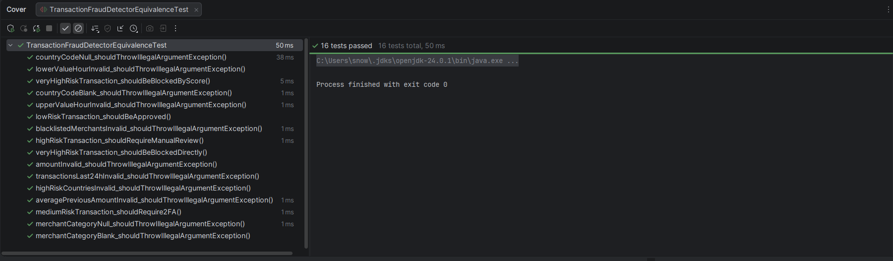
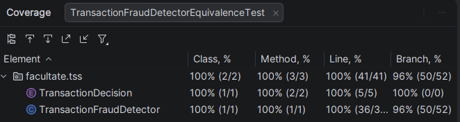
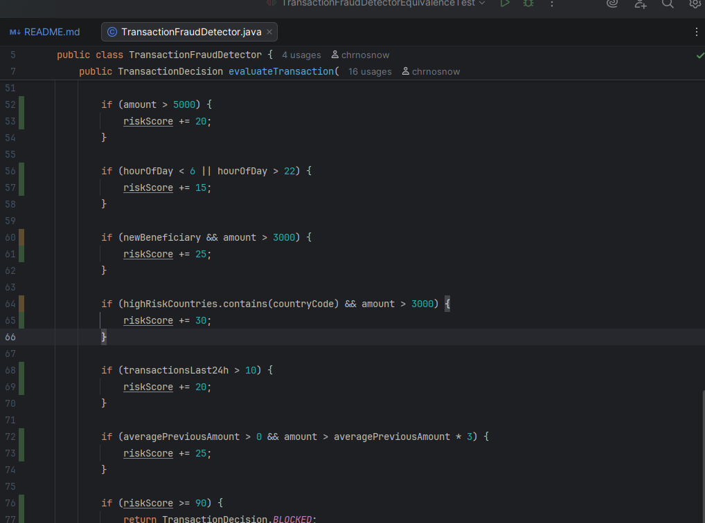

# Documentație testare

## Descriere generală

Aplicația implementează un **detector de fraudă pentru tranzacții bancare/card**. Pe baza datelor unei tranzacții și a
unor liste de risc, sistemul calculează un scor de risc și returnează o decizie privind procesarea tranzacției.

Componenta principală este clasa `facultate.tss.TransactionFraudDetector`, care expune metoda
`evaluateTransaction(...)`. Decizia returnată este de tipul `facultate.tss.TransactionDecision`.

## Specificația programului

### Intrări

Metoda `evaluateTransaction` primește următorii parametri:

| # | Parametru               | Tip           | Descriere                                                            | Constrângeri            |
|---|-------------------------|---------------|----------------------------------------------------------------------|-------------------------|
| 1 | `amount`                | `double`      | Suma tranzacției                                                     | Strict pozitivă (`> 0`) |
| 2 | `hourOfDay`             | `int`         | Ora la care s-a efectuat tranzacția                                  | În intervalul `[0, 23]` |
| 3 | `newBeneficiary`        | `boolean`     | `true` dacă beneficiarul nu a mai apărut în istoricul utilizatorului | &ndash;                 |
| 4 | `countryCode`           | `String`      | Codul țării în care se efectuează tranzacția                         | Non-null, non-blank     |
| 5 | `merchantCategory`      | `String`      | Categoria comerciantului                                             | Non-null, non-blank     |
| 6 | `transactionsLast24h`   | `int`         | Numărul de tranzacții efectuate în ultimele 24 de ore                | `>= 0`                  |
| 7 | `averagePreviousAmount` | `double`      | Media sumelor tranzacțiilor anterioare                               | `>= 0`                  |
| 8 | `highRiskCountries`     | `Set<String>` | Setul codurilor de țară considerate cu risc ridicat                  | Non-null (poate fi gol) |
| 9 | `blacklistedMerchants`  | `Set<String>` | Setul categoriilor de comercianți blocate                            | Non-null (poate fi gol) |

### Validări (excepții)

Metoda aruncă `IllegalArgumentException` în următoarele situații:

- `amount <= 0`
- `hourOfDay < 0` sau `hourOfDay > 23`
- `countryCode` este `null` sau blank
- `merchantCategory` este `null` sau blank
- `transactionsLast24h < 0` sau `averagePreviousAmount < 0`
- `highRiskCountries` sau `blacklistedMerchants` este `null`

### Reguli de decizie

1. **Blocare imediată**: dacă `merchantCategory` este în `blacklistedMerchants`, decizia este `BLOCKED`, fără calcul de
   scor.
2. Altfel, se calculează un **scor de risc** (`riskScore`), inițial `0`, prin însumarea punctelor:
    - `+10` dacă `amount > 1000`
    - `+20` dacă `amount > 5000` (cumulativ cu regula precedentă)
    - `+15` dacă `hourOfDay < 6` sau `hourOfDay > 22` (tranzacții nocturne)
    - `+25` dacă `newBeneficiary == true` și `amount > 3000`
    - `+30` dacă `countryCode` este în `highRiskCountries` și `amount > 3000`
    - `+20` dacă `transactionsLast24h > 10`
    - `+25` dacă `averagePreviousAmount > 0` și `amount > 3 * averagePreviousAmount`

### Ieșiri

Pe baza scorului final, metoda returnează una dintre valorile enum-ului `TransactionDecision`:

- **`BLOCKED`** dacă `riskScore >= 90` (sau dacă `merchantCategory` este în blacklist).
- **`MANUAL_REVIEW`** dacă `60 <= riskScore < 90`.
- **`REQUIRES_2FA`** dacă `30 <= riskScore < 60`.
- **`APPROVED`** dacă `riskScore < 30`.

## Partiționare de echivalență

### Clase pentru date de intrare invalide

| Clasă | Condiție                       | Comportament așteptat |
|-------|--------------------------------|-----------------------|
| I1    | `amount <= 0`                  | excepție              |
| I2    | `hourOfDay < 0`                | excepție              |
| I3    | `hourOfDay > 23`               | excepție              |
| I4    | `countryCode == null`          | excepție              |
| I5    | `countryCode.isBlank()`        | excepție              |
| I6    | `merchantCategory == null`     | excepție              |
| I7    | `merchantCategory.isBlank()`   | excepție              |
| I8    | `transactionsLast24h < 0`      | excepție              |
| I9    | `averagePreviousAmount < 0`    | excepție              |
| I10   | `highRiskCountries == null`    | excepție              |
| I11   | `blacklistedMerchants == null` | excepție              |

### Clase pentru date de intrare valide

Pentru fiecare parametru, domeniul valid se partiționează după pragurile/condițiile care influențează decizia (regulile
de scor sau scurtcircuitul prin blacklist).

| Clasă | Parametru               | Condiție                                                             | Efect asupra deciziei                                         |
|-------|-------------------------|----------------------------------------------------------------------|---------------------------------------------------------------|
| V1    | `amount`                | `0 < amount <= 1000`                                                 | nu adaugă puncte din pragurile de sumă                        |
| V2    | `amount`                | `1000 < amount <= 3000`                                              | `+10` din pragul `>1000`                                      |
| V3    | `amount`                | `3000 < amount <= 5000`                                              | `+10` și activează regulile cu prag `>3000`                   |
| V4    | `amount`                | `amount > 5000`                                                      | `+10` și `+20` și activează regulile cu prag `>3000`          |
| V5    | `hourOfDay`             | `0 <= hourOfDay <= 5`                                                | `+15` (interval nocturn de jos)                               |
| V6    | `hourOfDay`             | `6 <= hourOfDay <= 22`                                               | `0` (interval diurn)                                          |
| V7    | `hourOfDay`             | `hourOfDay == 23`                                                    | `+15` (interval nocturn de sus)                               |
| V8    | `newBeneficiary`        | `true`                                                               | activează regula `+25 dacă amount > 3000`                     |
| V9    | `newBeneficiary`        | `false`                                                              | regula este inactivă                                          |
| V10   | `countryCode`           | `countryCode ∈ highRiskCountries`                                    | activează regula `+30 dacă amount > 3000`                     |
| V11   | `countryCode`           | `countryCode ∉ highRiskCountries` (non-blank)                        | regula este inactivă                                          |
| V12   | `merchantCategory`      | `merchantCategory ∈ blacklistedMerchants`                            | scurtcircuit: returnează `BLOCKED` fără calcul de scor        |
| V13   | `merchantCategory`      | `merchantCategory ∉ blacklistedMerchants` (non-blank)                | continuă cu calculul scorului                                 |
| V14   | `transactionsLast24h`   | `0 <= transactionsLast24h <= 10`                                     | `0`                                                           |
| V15   | `transactionsLast24h`   | `transactionsLast24h > 10`                                           | `+20`                                                         |
| V16   | `averagePreviousAmount` | `averagePreviousAmount == 0`                                         | regula multiplului dezactivată (`> 0` este parte din premisă) |
| V17   | `averagePreviousAmount` | `averagePreviousAmount > 0` și `amount <= 3 * averagePreviousAmount` | regula multiplului inactivă                                   |
| V18   | `averagePreviousAmount` | `averagePreviousAmount > 0` și `amount > 3 * averagePreviousAmount`  | `+25`                                                         |

**Observație.** Parametrii `highRiskCountries` și `blacklistedMerchants` sunt acoperiți implicit prin clasele de
membership V10–V13. Cazurile **set gol** sunt subcazuri reprezentative ale V11 (respectiv V13), iar **set ne-gol care
conține valoarea** corespund V10 (respectiv V12).

### Clase pentru date de ieșire

Domeniul de ieșire este enum-ul `TransactionDecision`. Partiționarea reflectă atât valoarea returnată, cât și calea prin
care este produsă (pentru `BLOCKED` există două căi distincte).

| Clasă | Decizie         | Condiție declanșatoare                                                             |
|-------|-----------------|------------------------------------------------------------------------------------|
| O1    | `APPROVED`      | `merchantCategory ∉ blacklistedMerchants` și `riskScore < 30`                      |
| O2    | `REQUIRES_2FA`  | `merchantCategory ∉ blacklistedMerchants` și `30 <= riskScore < 60`                |
| O3    | `MANUAL_REVIEW` | `merchantCategory ∉ blacklistedMerchants` și `60 <= riskScore < 90`                |
| O4    | `BLOCKED`       | `merchantCategory ∉ blacklistedMerchants` și `riskScore >= 90` (blocare prin scor) |
| O5    | `BLOCKED`       | `merchantCategory ∈ blacklistedMerchants` (scurtcircuit, fără calcul de scor)      |

### Setul minimal de teste prin partiționare de echivalență

Clasele de echivalență globale ale programului se obțin **combinând** clasele individuale ale fiecărui parametru. Setul
minimal se construiește pe principiul:

- **Câte un test per clasă invalidă** (fiecare test izolează o singură invaliditate; restul intrărilor rămân valide,
  pentru ca excepția observată să fie cea așteptată).
- **Mai multe clase valide combinate într-un singur test** (parametri independenți pot fi acoperiți simultan); numărul
  minim de teste valide este `max` peste numărul de clase valide per parametru = **4** (de la `amount` cu V1–V4), iar o
  a 5-a iterație este necesară pentru a acoperi și cele 5 clase de ieșire (O1–O5).

**Constante** folosite în toate testele:

- `highRiskCountries = {"KP", "IR", "MM"}` &ndash; coduri ISO 3166-1 alpha-2 pentru Coreea de Nord, Iran și Myanmar,
  țările aflate pe lista neagră FATF (*High-Risk Jurisdictions subject to a Call for Action*) [[1]](#bibliografie).
- `blacklistedMerchants = {"GAMBLING", "CRYPTO_EXCHANGE", "FIREARMS"}`

**Valori baseline valide** (folosite în testele invalide pentru parametrii nemodificați):

- `amount = 100.0`, `hourOfDay = 11`, `newBeneficiary = false`, `countryCode = "RO"`,
  `merchantCategory = "GROCERY STORES"`,
  `transactionsLast24h = 5`, `averagePreviousAmount = 50.0`

### Teste pentru clase invalide

| Test | Clasă | Parametru modificat               | Rezultat așteptat          |
|------|-------|-----------------------------------|----------------------------|
| TI1  | I1    | `amount = -100`                   | `IllegalArgumentException` |
| TI2  | I2    | `hourOfDay = -10`                 | `IllegalArgumentException` |
| TI3  | I3    | `hourOfDay = 26`                  | `IllegalArgumentException` |
| TI4  | I4    | `countryCode = null`              | `IllegalArgumentException` |
| TI5  | I5    | `countryCode = "  "`              | `IllegalArgumentException` |
| TI6  | I6    | `merchantCategory = null`         | `IllegalArgumentException` |
| TI7  | I7    | `merchantCategory = ""`           | `IllegalArgumentException` |
| TI8  | I8    | `transactionsLast24h = -3`        | `IllegalArgumentException` |
| TI9  | I9    | `averagePreviousAmount = -1000.0` | `IllegalArgumentException` |
| TI10 | I10   | `highRiskCountries = null`        | `IllegalArgumentException` |
| TI11 | I11   | `blacklistedMerchants = null`     | `IllegalArgumentException` |

### Teste pentru clase valide (acoperă și clasele de ieșire)

| Test | Clase de intrare acoperite     | `amount` | `hour` | `newBen` | `country` | `merchant`                        | `tx24` | `avgPrev` | Ieșire | Rezultat așteptat           |
|------|--------------------------------|----------|--------|----------|-----------|-----------------------------------|--------|-----------|--------|-----------------------------|
| TV1  | V1, V6, V9, V11, V13, V14, V16 | 70       | 11     | false    | "RO"      | "GROCERY STORES"                  | 5      | 0.0       | O1     | `APPROVED` (scor `0`)       |
| TV2  | V2, V5, V9, V11, V13, V15, V17 | 2500     | 3      | false    | "RO"      | "DENTAL AND MEDICAL LABORATORIES" | 15     | 1000.0    | O2     | `REQUIRES_2FA` (scor `45`)  |
| TV3  | V3, V7, V8, V10, V13, V14, V17 | 4000     | 23     | true     | "KP"      | "SHOE STORES"                     | 5      | 2000.0    | O3     | `MANUAL_REVIEW` (scor `80`) |
| TV4  | V4, V6, V8, V10, V13, V15, V18 | 6000     | 12     | true     | "IR"      | "GROCERY STORES"                  | 15     | 1000.0    | O4     | `BLOCKED` prin scor (`130`) |
| TV5  | V1, V6, V9, V11, V12, V14, V17 | 500      | 12     | false    | "RO"      | "GAMBLING"                        | 5      | 200.0     | O5     | `BLOCKED` prin blacklist    |

### Rularea testelor

Cele 16 teste din clasa `TransactionFraudDetectorEquivalenceTest` (11 invalide + 5 valide) trec integral:



### Acoperire

Acoperirea a fost măsurată cu runner-ul IntelliJ IDEA, după rularea exclusivă a suitei de partiționare de echivalență:



#### Interpretare

- **Acoperire pe linii / instrucțiuni: 100%** &ndash; toate liniile metodei `evaluateTransaction` sunt executate de
  setul minimal de teste.
- **Acoperire pe ramuri: sub 100%** &ndash; rămân neacoperite două ramuri în condițiile compuse cu `&&`:



```java
if (newBeneficiary && amount > 3000) { ... }
if (highRiskCountries.contains(countryCode) && amount > 3000) { ... }
```

În ambele cazuri lipsește subcombinația "operand stâng `true`, operand drept `false`", adică:

- `newBeneficiary == true` și `amount <= 3000`
- `countryCode ∈ highRiskCountries` și`amount <= 3000`

Motivul este metodologic, nu o deficiență a partiționării. Tehnica de partiționare de echivalență este una
**black-box**: clasele se derivă din specificație, iar specificația tratează cele două reguli de scor ca pe niște
condiții atomice (se aplică doar dacă ambele premise sunt adevărate). Nu există în specificație o partiție
naturală pentru subcazul "premisa secundară falsă", deoarece comportamentul observabil este identic cu al cazului în
care premisa primară este falsă (regula nu se aplică, scorul rămâne neschimbat).

Acoperirea completă pe ramuri se poate obține complementar, prin testare **white-box** (criteriul branch coverage).

## Bibliografie

1. <a id="bibliografie"></a>**Financial Action Task Force (FATF)**, *High-Risk Jurisdictions subject to a Call for
   Action* ("black list"). Disponibil online la: <https://www.fatf-gafi.org/en/countries/black-and-grey-lists.html> (
   accesat la 01.05.2026).

