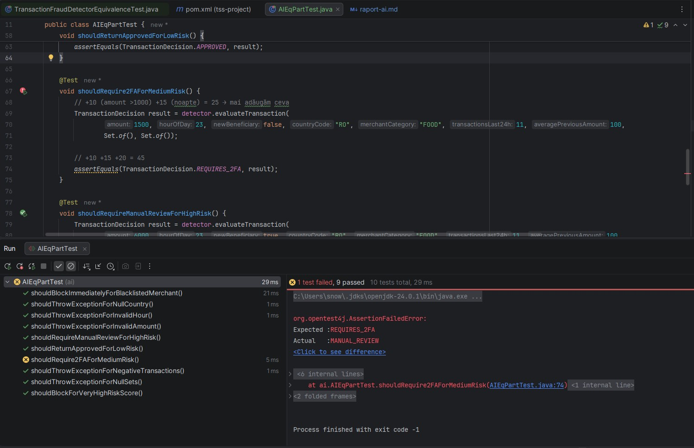
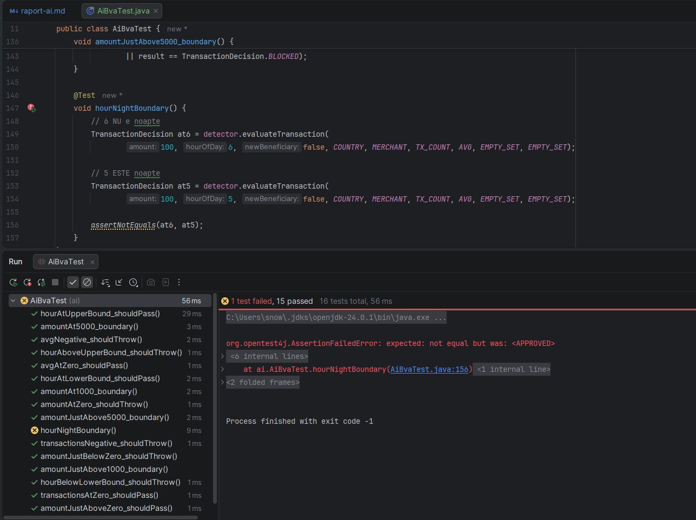
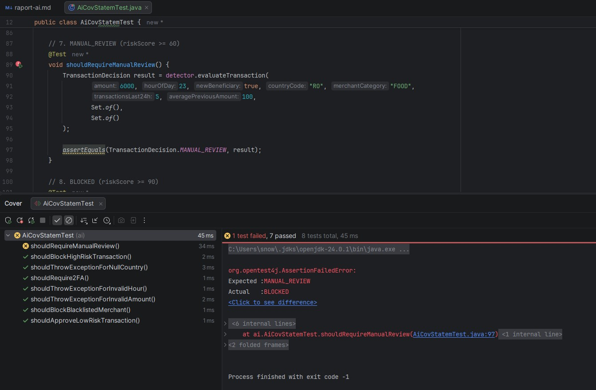
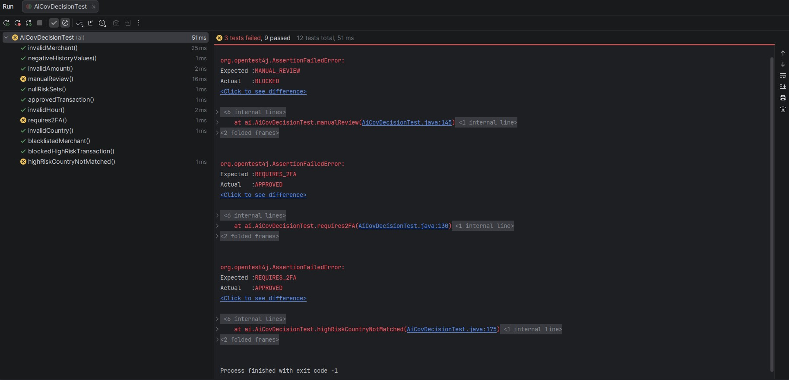
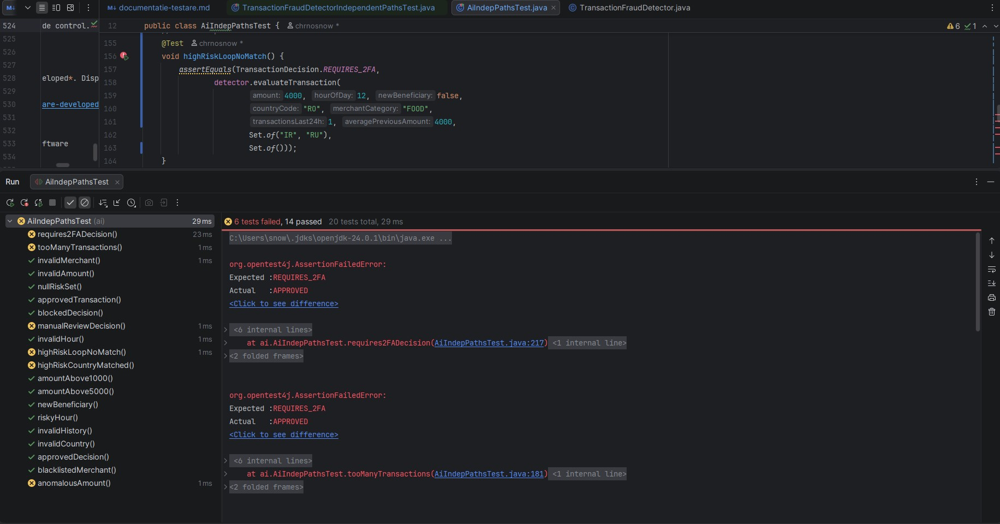

# Raport AI &ndash; comparație suite de teste proprii vs. autogenerate

Raportul de față documentează **utilizarea unui asistent AI** (ChatGPT) pentru generarea
automată de suite de teste unitare pentru clasa `facultate.tss.TransactionFraudDetector`
și **comparația** cu suitele proprii, derivate manual din specificație. Pentru fiecare
tehnică de testare aplicată în proiect (partiționare în clase de echivalență, analiză a
valorilor de frontieră, testare structurală, mutation testing etc.) se va adăuga o
secțiune dedicată, urmând aceeași structură: tool folosit, prompt, răspuns, rulare,
comparație cu suita proprie, interpretare și referințe bibliografice.

Obiectivele raportului:

- evidențierea **diferențelor cantitative și calitative** între suitele autogenerate și
  cele construite manual (acoperire a claselor de echivalență/frontierelor/ramurilor,
  corectitudinea oracolelor, trasabilitatea către specificație);
- discutarea **limitărilor LLM-urilor** în sarcini de proiectare a testelor, cu
  citate din literatura de specialitate;
- păstrarea unei **dovezi reproductibile** (prompturi, capturi de ecran și fișiere
  sursă commit-ate în repository).

## Partiționare în clase de echivalență

### Tool folosit

Pentru generarea automată a suitei de teste prin partiționare în clase de echivalență am
folosit **ChatGPT** (modelul GPT-5.3, interfața web, conversație din 03.05.2026). Captura
integrală a dialogului este arhivată în
[
`screenshots/ai/eq-bva-screencapture-chatgpt-c-69f71939-7070-83eb-bb1b-39926fd91f64-2026-05-04-21_43_59.pdf`](screenshots/ai/eq-bva-screencapture-chatgpt-c-69f71939-7070-83eb-bb1b-39926fd91f64-2026-05-04-21_43_59.pdf).

ChatGPT a fost ales pentru că este un *Large Language Model* generalist, antrenat pe
volume mari de date textuale și multimodale, inclusiv date de cod, provenite din surse publice,
licențiate și generate/provizionate în procesul de antrenare [[1]](#bibliografie).

### Prompt

Promptul a fost minimalist (*zero-shot*, fără atribuire de rol și fără exemple) și a
folosit o abordare strict **black-box**: am furnizat doar **specificația** programului
(descriere generală, parametri, validări, reguli de decizie și ieșiri - copiată ca
text din [`documentatie-testare.md`](documentatie-testare.md)), urmată de o singură
propoziție în limba română:

> *\[specificația completă a programului\]*
>
> *Scrie setul minim de teste unitare pentru partitionarea in clase de echivalenta
> utilizand libraria junit5 (java/maven).*

Această formulare minimalistă este suficientă pentru generațiile recente de modele
(GPT-4 și ulterioare): un studiu sistematic pe 4 modele și 162 de roluri arată că
**atribuirea unui rol în system prompt nu îmbunătățește semnificativ acuratețea** pe
benchmark-uri obiective (uneori chiar o degradează), iar efectul este
imprevizibil de la un task la altul [[3]](#bibliografie). În consecință, am preferat un
prompt scurt, lăsând modelul să-și aplice politica implicită de generare; eventualele
limitări observate ulterior sunt astfel atribuibile modelului, nu unei formulări
subdimensionate a cererii. Furnizarea **specificației** (nu a codului) este, în plus,
fidelă tehnicii black-box [[4]](#bibliografie): modelul nu poate "ghici" decizia citind
implementarea, ci trebuie să o deducă din regulile descrise.

### Răspuns

ChatGPT a răspuns cu o suită de **10 metode de test** (transcrise integral în
[`src/test/java/ai/AIEqPartTest.java`](../src/test/java/ai/AIEqPartTest.java)),
grupate prin comentarii în două secțiuni: `// --- VALIDARI ---` (5 teste) și
`// --- REGULI FUNCTIONALE ---` (5 teste). Modelul a justificat alegerea ca *„set
minimal”* prin acoperirea explicită a:

- claselor de echivalență valide pentru fiecare interval de scor (APPROVED, REQUIRES_2FA,
  MANUAL_REVIEW, BLOCKED);
- claselor invalide pentru fiecare validare (`amount`, `hour`, `null`, valori negative,
  seturi `null`);
- regulii speciale de scurtcircuit prin blacklist.

În răspuns, modelul a inclus o **observație autocritică explicită** privind testul
`shouldRequireManualReviewForHighRisk`:

> *„Acest test acceptă două rezultate (`MANUAL_REVIEW` sau `BLOCKED`). Asta pentru că
> scorul poate depăși 90 în funcție de implementare - iar în practică ar fi mai
> bine să controlezi exact scorul dacă vrei test strict.”*

Această dublă acceptare se traduce într-un `assertTrue(result == MANUAL_REVIEW ||
result == BLOCKED)` - testul trece atâta timp cât rezultatul nu este `APPROVED`
sau `REQUIRES_2FA`. Modelul a recunoscut explicit că nu poate calcula deterministic
scorul așteptat și a slăbit criteriul de acceptare ca să evite un eșec.

### Rulare

Suita generată a fost rulată cu runner-ul JUnit din IntelliJ IDEA. **9 din 10 teste
trec**, iar testul `shouldRequire2FAForMediumRisk` **a picat**:



```
Expected :REQUIRES_2FA
Actual   :MANUAL_REVIEW
at ai.AIEqPartTest.shouldRequire2FAForMediumRisk(AIEqPartTest.java:74)
```

Pentru intrările `(amount=1500, hour=23, newBen=false, "RO", "FOOD", tx24=11,
avgPrev=100)`, comentariul modelului justifica scorul ca `+10 (>1000) + 15 (noapte)+ 20 (tx>10) = 45`,
însă a omis regula `+25 dacă averagePreviousAmount > 0 și amount > 3 * averagePreviousAmount`
(`1500 > 3 * 100 = 300`). Scorul real este `10 + 15 + 20 + 25 = 70`, ceea ce încadrează rezultatul
în `MANUAL_REVIEW`. Deși regula era explicit prezentă în prompt, modelul nu a omis-o din ignoranță,
ci dintr-o greșeală aritmetică, o limitare cunoscută a LLM-urilor pe sarcini de calcul precis [[5]](#bibliografie).

### Comparație cu suita proprie

Suita proprie (`TransactionFraudDetectorEquivalenceTest`, 16 teste) a fost derivată
sistematic din partițiile documentate în [`documentatie-testare.md`](documentatie-testare.md)
(11 clase invalide I1-I11, 18 clase valide V1-V18, 5 clase de ieșire
O1-O5). Suita generată de ChatGPT (10 teste, 1 picat) acoperă doar parțial aceleași
partiții.

#### Comparație între teste

| Aspect                            | Suită proprie | Suită AI (ChatGPT)                         |
|-----------------------------------|---------------|--------------------------------------------|
| Număr total de teste              | **16**        | 10 (1 picat)                               |
| Teste pentru clase invalide       | 11            | 5                                          |
| Teste pentru clase valide         | 5             | 5                                          |
| Clase invalide acoperite (I1-I11) | **11 / 11**   | 5 / 11                                     |
| Clase de ieșire acoperite (O1-O5) | **5 / 5**     | 3 / 5 strict, 4 / 5 cu aserțiune permisivă |
| Teste care **trec**               | 16 / 16       | 9 / 10                                     |

#### Diferențe pe clasele invalide

| Clasă | Condiție                       | Suită proprie | Suită AI                                             |
|-------|--------------------------------|---------------|------------------------------------------------------|
| I1    | `amount <= 0`                  | TI1 (`-100`)  | `shouldThrowExceptionForInvalidAmount` (`0`)         |
| I2    | `hourOfDay < 0`                | TI2 (`-10`)   | **lipsă**                                            |
| I3    | `hourOfDay > 23`               | TI3 (`26`)    | `shouldThrowExceptionForInvalidHour` (`24`)          |
| I4    | `countryCode == null`          | TI4           | `shouldThrowExceptionForNullCountry`                 |
| I5    | `countryCode.isBlank()`        | TI5           | **lipsă**                                            |
| I6    | `merchantCategory == null`     | TI6           | **lipsă**                                            |
| I7    | `merchantCategory.isBlank()`   | TI7           | **lipsă**                                            |
| I8    | `transactionsLast24h < 0`      | TI8 (`-3`)    | `shouldThrowExceptionForNegativeTransactions` (`-1`) |
| I9    | `averagePreviousAmount < 0`    | TI9           | **lipsă**                                            |
| I10   | `highRiskCountries == null`    | TI10          | `shouldThrowExceptionForNullSets`                    |
| I11   | `blacklistedMerchants == null` | TI11          | **lipsă**                                            |

**Probleme metodologice ale suitei AI**:

1. **Subacoperire a claselor invalide** (5/11): lipsesc `hourOfDay < 0`,
   `countryCode.isBlank`, ambele forme de invalidate ale `merchantCategory`,
   `averagePreviousAmount < 0` și `blacklistedMerchants = null`. Modelul a tratat
   `countryCode == null/blank` și `merchantCategory == null/blank` ca pe o singură clasă,
   în pofida faptului că specificația din prompt le tratează ca pe două condiții
   distincte.
2. **Eroare aritmetică la testul** `shouldRequire2FAForMediumRisk`: modelul a
   omis o regulă din specificație (multiplul mediei), generând un test care pică.
3. **Aserțiune permisivă** (`assertTrue(a || b)`) la
   `shouldRequireManualReviewForHighRisk`: când modelul nu reușește să calculeze
   deterministic rezultatul, acceptă mai multe rezultate posibile în loc să rafineze
   datele de intrare.

#### Diferențe pe clasele valide și de ieșire

| Clasă                        | Acoperire suită proprie | Acoperire suită AI                                                      |
|------------------------------|-------------------------|-------------------------------------------------------------------------|
| V1-V4 (`amount`)             | toate 4 (TV1-TV4)       | V1, V2, V4 - **lipsesc** V3 (`3000 < amount <= 5000`)                   |
| V5-V7 (`hourOfDay`)          | toate 3                 | V6, V7 - **lipsește** V5 (interval nocturn de jos)                      |
| V10/V11 (`countryCode`)      | ambele                  | ambele (V10 doar în testul de blocare prin scor extrem)                 |
| V12/V13 (`merchantCategory`) | ambele                  | ambele                                                                  |
| V16-V18 (`avgPrev`)          | toate 3                 | doar V18 - **lipsesc** V16, V17                                         |
| O1 `APPROVED`                | TV1                     | `shouldReturnApprovedForLowRisk`                                        |
| O2 `REQUIRES_2FA`            | TV2                     | `shouldRequire2FAForMediumRisk` - **picat**, deci O2 efectiv neacoperit |
| O3 `MANUAL_REVIEW`           | TV3                     | `shouldRequireManualReviewForHighRisk` - doar prin aserțiune permisivă  |
| O4 `BLOCKED` prin scor       | TV4                     | `shouldBlockForVeryHighRiskScore`                                       |
| O5 `BLOCKED` prin blacklist  | TV5                     | `shouldBlockImmediatelyForBlacklistedMerchant`                          |

ChatGPT a produs o suită **incompletă și parțial incorectă**:

- **Puncte forte**: sintaxă JUnit 5 corectă, separare clară între validări și reguli
  funcționale, izolarea clasei `I10` într-un singur test (un singur `null` per apel),
  recunoașterea explicită a propriei limite în testul `shouldRequireManualReviewForHighRisk`.
- **Puncte slabe**:

1. deși specificația era explicită și completă în prompt,
   modelul a *grupat* clasele invalide apropiate semantic (string-uri `null`/blank,
   ambele seturi `null`) și a sărit peste 6 din 11 clase. Comportamentul este consistent
   cu observațiile din literatură: LLM-urile generează teste cu acoperire **mai mică**
   decât suitele derivate manual din specificație, în special pe ramurile de
   validare/excepție [[2]](#bibliografie).
2. greșeala aritmetică din `shouldRequire2FAForMediumRisk`
   arată că modelul nu execută programul, ci aproximează scorul din specificație. Pentru
   un test cu mai mult de 3-4 reguli aditive, riscul de eroare crește substanțial.
3. aserțiunea permisivă din
   `shouldRequireManualReviewForHighRisk` (`assertTrue(MANUAL_REVIEW || BLOCKED)`) este un
   *test smell* clasic (*Conditional Test Logic*) [[6]](#bibliografie). Modelul a preferat
   să slăbească verificarea în loc să aleagă date de intrare care produc un scor
   neambiguu.

## Analiza valorilor de frontieră

### Tool și prompt

Aceeași sesiune ChatGPT din secțiunea anterioară, continuată cu o cerere nouă (arhiva
completă a conversației este în
[
`screenshots/ai/eq-bva-screencapture-chatgpt-c-69f71939-7070-83eb-bb1b-39926fd91f64-2026-05-04-21_43_59.pdf`](screenshots/ai/eq-bva-screencapture-chatgpt-c-69f71939-7070-83eb-bb1b-39926fd91f64-2026-05-04-21_43_59.pdf)):

> *Scrie acum si setul minim de teste pentru analiza valorilor de frontiera, cu aceeasi
> librarie.*

Specificația rămăsese în context din promptul anterior, deci nu a mai fost recopiată.

### Răspuns și rulare

ChatGPT a livrat **16 metode de test** (transcrise în
[`src/test/java/ai/AiBvaTest.java`](../src/test/java/ai/AiBvaTest.java)): 11 teste de
validare la frontieră (`amount`, `hour`, `tx`, `avg`), 4 teste de prag pe `amount`
(`1000`, `1000.01`, `5000`, `5000.01`) și 1 test pe frontiera nocturnă `hour = 5/6`
&ndash; **acesta a picat**:



```
org.opentest4j.AssertionFailedError: expected: not equal but was: <APPROVED>
at ai.AiBvaTest.hourNightBoundary(AiBvaTest.java:156)
```

Testul `hourNightBoundary` verifică faptul că deciziile la `hour = 6` (zi) și
`hour = 5` (noapte) nu sunt egale, presupunând că trecerea peste pragul `hour < 6` modifică decizia. La
inputurile alese (baseline `amount = 100`), însă, scorul rămâne sub pragul `30` în ambele
cazuri (`0` la zi, `15` la noapte), iar decizia este `APPROVED`. Modelul a confundat
**frontiera regulii de scor** (`hour < 6` adaugă `+15`) cu **frontiera deciziei**
(`riskScore >= 30` schimbă clasa). Testul a fost comentat pentru a permite rularea cu
acoperire.

### Comparație cu suita proprie

Suita proprie (`TransactionFraudDetectorBoundaryTest`, **29 teste**) acoperă sistematic
cele trei categorii F-V / F-S / F-D; suita AI (**16 teste, 1 picat**) acoperă parțial
F-V, doar 4 din 13 frontiere F-S, iar **F-D lipsește integral**.

| Categorie                      | Suită proprie | Suită AI                                                        |
|--------------------------------|---------------|-----------------------------------------------------------------|
| F-V invalide                   | 5             | 6 (1 redundantă: `amount = -0.01` + `amount = 0` aceeași clasă) |
| F-V valide                     | 5             | 5 (doar `assertDoesNotThrow`, fără verificarea deciziei)        |
| F-S `amount > 1000` / `> 5000` | 4             | 4 (3 cu aserțiuni permisive: `assertNotEquals`, `assertTrue ‖`) |
| F-S `newBen && amount > 3000`  | 2             | **0**                                                           |
| F-S `hour < 6` / `> 22`        | 4             | 1 picat (comentat)                                              |
| F-S `tx > 10`                  | 2             | **0**                                                           |
| F-S `amount > 3 · avgPrev`     | 2             | **0** (activată însă prin baseline `AVG = 100`)                 |
| F-D praguri `30` / `60` / `90` | 6             | **0**                                                           |
| Teste care **trec**            | 29 / 29       | 15 / 16                                                         |

Suita AI BVA introduce două probleme specifice:

1. **Confuzia frontieră-de-regulă vs. frontieră-de-decizie.** Modelul a tratat o variație de scor ca implicând
   automat o variație de decizie, ipoteză falsă când scorurile rămân de aceeași parte a
   unui prag de decizie. Consecința: F-D lipsește integral (nicio combinație de reguli
   activate care să exerseze pragurile `30` / `60` / `90`).
2. **Valoarea implicită `AVG = 100`** activează nedorit regula `amount > 3 * avgPrev`
   pentru orice `amount > 300`, deci toate testele de prag pe
   `amount` includ implicit un `+25`, iar testele pot trece din motive
   greșite (scor compus diferit de cel intenționat).

## Testare structurală

### Acoperire la nivel de instrucțiune

#### Tool și prompt

Pentru această tehnică am folosit o sesiune ChatGPT nouă, cu același model GPT-5.3. Captura integrală a dialogului
este arhivată în
[
`screenshots/ai/struct-screencapture-chatgpt-c-69fa4210-9304-8325-a872-f1ea7e63f78b-2026-05-05-22_18_57.pdf`](screenshots/ai/struct-screencapture-chatgpt-c-69fa4210-9304-8325-a872-f1ea7e63f78b-2026-05-05-22_18_57.pdf).
Promptul a urmat aceeași abordare *zero-shot*: cerere scurtă pentru setul minim de teste
care să atingă acoperirea la nivel de instrucțiune, folosind JUnit 5, urmată de clasa integrală
`TransactionFraudDetector` .

#### Răspuns și rulare

ChatGPT a generat **8 metode de test** (transcrise în
[`src/test/java/ai/AiCovStatemTest.java`](../src/test/java/ai/AiCovStatemTest.java)): 3 pentru excepții,
1 pentru scurtcircuitul prin blacklist și 4 pentru deciziile finale (`APPROVED`, `REQUIRES_2FA`,
`MANUAL_REVIEW`, `BLOCKED` prin scor). La rulare, 7 din 8 teste trec, iar
`shouldRequireManualReview` pică:



```
org.opentest4j.AssertionFailedError:
Expected :MANUAL_REVIEW
Actual   :BLOCKED
at ai.AiCovStatemTest.shouldRequireManualReview(AiCovStatemTest.java:97)
```

Pentru intrările alese (`amount = 6000`, `hour = 23`, `newBen = true`, `country = "RO"`, `tx24 = 5`,
`avg = 100`), comentariul modelului estima un scor de `80` și încadra rezultatul în `MANUAL_REVIEW`, dar a
omis din nou regula `amount > 3 * avgPrev` (`6000 > 300`), care adaugă încă `+25`, urcând
scorul real la `95` și schimbând decizia în `BLOCKED`. Aceeași limitare aritmetică observată la suita EP
(testul `shouldRequire2FAForMediumRisk`) se manifestă și aici, pe aceeași regulă.

#### Comparație cu suita proprie

Suita proprie (`TransactionFraudDetectorStatementCoverageTest`, 11 teste) acoperă fiecare instrucțiune
executabilă a metodei `evaluateTransaction`. Suita AI (8 teste) lasă neacoperite mai multe instrucțiuni țintă:

| Instrucțiune țintă                                 | Suită proprie | Suită AI                                              |
|----------------------------------------------------|---------------|-------------------------------------------------------|
| `throw` din validarea `amount`                     | TS1           | `shouldThrowExceptionForInvalidAmount`                |
| `throw` din validarea `hourOfDay`                  | TS2           | `shouldThrowExceptionForInvalidHour`                  |
| `throw` din validarea `countryCode`                | TS3           | `shouldThrowExceptionForNullCountry`                  |
| `throw` din validarea `merchantCategory`           | TS4           | **lipsă**                                             |
| `throw` din validarea istoricului (`tx24` / `avg`) | TS5           | **lipsă**                                             |
| `throw` din validarea seturilor `null`             | TS6           | **lipsă** (folosește `Set.of()` peste tot, nu `null`) |
| `return BLOCKED` din scurtcircuitul blacklist      | TS7           | `shouldBlockBlacklistedMerchant`                      |
| Toate `riskScore += ...` + corpul `for` (`break`)  | TS8           | `shouldBlockHighRiskTransaction`                      |
| `return APPROVED`                                  | TS9           | `shouldApproveLowRiskTransaction`                     |
| `return REQUIRES_2FA`                              | TS10          | `shouldRequire2FA`                                    |
| `return MANUAL_REVIEW`                             | TS11          | `shouldRequireManualReview` &ndash; picat             |
| Teste care trec                                    | 11 / 11       | 7 / 8 (1 picat, comentat pentru rulare)               |

Probleme specifice ale suitei AI pe acest criteriu:

1. **Subacoperire pe blocurile `throw`** (3/6): lipsesc validările pentru `merchantCategory`, istoric
   (`tx24 < 0` / `avg < 0`) și seturi `null`. Modelul a folosit consecvent `Set.of()` (set gol valid) în loc
   de `null`, deci validarea `highRiskCountries == null` / `blacklistedMerchants == null` nu este atinsă de
   niciun test.
2. **Returnul `MANUAL_REVIEW` neacoperit**: singurul test pentru această decizie pică din cauza
   aceleiași omisiuni a regulii multiplului mediei observate la suita EP. Pentru a permite rularea cu
   acoperire, testul a fost comentat (similar cu `hourNightBoundary` din suita BVA), deci instrucțiunea
   `return MANUAL_REVIEW` rămâne neexecutată de suita AI.

### Acoperire la nivel de decizie (ramură)

#### Tool și prompt

Aceeași sesiune ChatGPT din secțiunea anterioară, continuată cu o cerere nouă (arhiva
completă a conversației, actualizată după acest schimb, este în același fișier
[
`screenshots/ai/struct-screencapture-chatgpt-c-69fa4210-9304-8325-a872-f1ea7e63f78b-2026-05-05-22_18_57.pdf`](screenshots/ai/struct-screencapture-chatgpt-c-69fa4210-9304-8325-a872-f1ea7e63f78b-2026-05-05-22_18_57.pdf)):

> *Genereaza setul minim de teste unitare pentru acoperirea la nivel de decizie (ramura).*

Codul-sursă al clasei `TransactionFraudDetector` rămăsese în context din promptul anterior, deci nu a mai
fost recopiat.

#### Răspuns și rulare

ChatGPT a generat **12 metode de test** (transcrise în
[`src/test/java/ai/AiCovDecisionTest.java`](../src/test/java/ai/AiCovDecisionTest.java)): 6 pentru cele
șase blocuri `throw`, 1 pentru scurtcircuitul prin blacklist, 4 pentru cele patru decizii finale
(`APPROVED`, `REQUIRES_2FA`, `MANUAL_REVIEW`, `BLOCKED` prin scor) și 1 test suplimentar
(`highRiskCountryNotMatched`) care exersează ramura în care bucla `for` peste `highRiskCountries` se
încheie fără potrivire (cu set ne-vid). La rulare, **9 din 12 teste trec**, iar `manualReview`,
`requires2FA` și `highRiskCountryNotMatched` pică:



```
Expected :MANUAL_REVIEW       Expected :REQUIRES_2FA       Expected :REQUIRES_2FA
Actual   :BLOCKED             Actual   :APPROVED           Actual   :APPROVED
at AiCovDecisionTest.manualReview(:145)
at AiCovDecisionTest.requires2FA(:130)
at AiCovDecisionTest.highRiskCountryNotMatched(:175)
```

Cele trei eșecuri se reduc la aceeași limitare aritmetică observată și la celelalte suitede teste: modelul fie omite,
fie aplică incorect regula `amount > 3 * averagePreviousAmount`:

- `manualReview` (`amount = 6000`, `newBen = true`, `avg = 1000`): modelul a calculat `+10 + 20 + 15 + 25 = 70`
  &rarr; `MANUAL_REVIEW`, dar a omis `+25` din regula multiplului (`6000 > 3 · 1000`); scorul real este `95`
  &rarr; `BLOCKED`.
- `requires2FA` (`amount = 1500`, `hour = 23`, `avg = 1000`): modelul a aproximat scorul peste `30`, dar
  niciuna dintre regulile `+25` (newBeneficiary, multiplul mediei) nu se activează (`1500 ≤ 3000`,
  `1500 ≤ 3 · 1000`); scorul real este `25` &rarr; `APPROVED`.
- `highRiskCountryNotMatched` (`amount = 4000`, `avg = 5000`): modelul a presupus că pragul `> 5000` se
  activează, dar `4000 < 5000`; cu `newBen = false` și `RO ∉ {IR, RU}`, doar `+10` (`> 1000`) se aplică,
  scor `10` &rarr; `APPROVED`.

#### Comparație cu suita proprie

Suita proprie (`TransactionFraudDetectorStatementCoverageTest`, 11 teste) satisface integral și
acoperirea la nivel de decizie, prin construcție (vezi tabelul de trasabilitate decizie &harr; test din
[`documentatie-testare.md`](documentatie-testare.md)). Suita AI (12 teste, 3 picate) ar fi acoperit teoretic
toate cele 38 de ramuri dacă oracolele ar fi fost corecte; cu doar cele **9 teste care trec**, rămân
neacoperite ramurile `true` ale deciziilor finale `D18` (`riskScore >= 60` &rarr; `MANUAL_REVIEW`) și
`D19` (`riskScore >= 30` &rarr; `REQUIRES_2FA`):

| Decizie                                            | Suită proprie  | Suită AI (teste care trec)                                                                                   |
|----------------------------------------------------|----------------|--------------------------------------------------------------------------------------------------------------|
| D1&ndash;D6 (cele 6 blocuri `throw`)               | TS1&ndash;TS6  | `invalidAmount`, `invalidHour`, `invalidCountry`, `invalidMerchant`, `negativeHistoryValues`, `nullRiskSets` |
| D7 (scurtcircuit blacklist)                        | TS7            | `blacklistedMerchant`                                                                                        |
| D12 (intrare în `for`) + D13 (potrivire + `break`) | TS8            | `blockedHighRiskTransaction` (`country = "IR"`, match)                                                       |
| D12 (parcurgere completă, fără `break`)            | TS9&ndash;TS11 | `approvedTransaction` (`country = "RO"`, fără potrivire)                                                     |
| D17 ramura `true` (`BLOCKED` prin scor)            | TS8            | `blockedHighRiskTransaction` (scor `145`)                                                                    |
| D18 ramura `true` (`MANUAL_REVIEW`)                | TS11           | `manualReview` &ndash; **picat**, ramură neacoperită                                                         |
| D19 ramura `true` (`REQUIRES_2FA`)                 | TS10           | `requires2FA` &ndash; **picat**; `highRiskCountryNotMatched` &ndash; **picat**, ramură neacoperită           |
| D19 ramura `false` (`APPROVED`)                    | TS9            | `approvedTransaction`                                                                                        |
| Teste care trec                                    | 11 / 11        | 9 / 12                                                                                                       |
| Acoperire la nivel de decizie                      | 38 / 38        | 36 / 38 (≈ 94.7%)                                                                                            |

Probleme specifice ale suitei AI pe acest criteriu:

1. **Două ramuri finale neacoperite**: din cele 4 clase de decizie partiționate de `D17 / D18 / D19`,
   suita AI acoperă în execuția cu succes doar `APPROVED` și `BLOCKED`. `REQUIRES_2FA` și `MANUAL_REVIEW`
   rămân neexecutate, deoarece toate cele trei teste care le țintesc pică cu același tip de eroare
   aritmetică pe regula multiplului mediei.
2. **Limitare aritmetică recurentă**: apare aceeași omisiune a regulii `amount > 3 * averagePreviousAmount`
   , confirmând empiric că modelul nu simulează execuția programului, ci aproximează scorul citind specificația/codul,
   iar pe combinații cu 4&ndash;5 reguli active probabilitatea de eroare devine semnificativă [[5]](#bibliografie).
3. Suita AI îmbunătățește marginal trasabilitatea pe bucla `for` față de suita
   proprie. `blockedHighRiskTransaction` (`country = "IR"`) și `highRiskCountryNotMatched`
   (`highRiskCountries = {"IR", "RU"}`, `country = "RO"`) separă explicit cele două ramuri ale deciziei
   `D13` (`country.equals(countryCode)` &ndash; `true` cu `break` vs. `false` cu parcurgere completă), în
   timp ce TS9&ndash;TS11 le exersează doar implicit, prin `country = "RO"` într-un set unic `{"KP", "IR", "MM"}`.

### Testare pe circuite independente

#### Tool și prompt

Aceeași sesiune ChatGPT din secțiunea precedentă, continuată cu cererea de mai jos
(arhiva completă a conversației, actualizată după acest schimb, este în același fișier
[
`screenshots/ai/struct-screencapture-chatgpt-c-69fa4210-9304-8325-a872-f1ea7e63f78b-2026-05-05-22_18_57.pdf`](screenshots/ai/struct-screencapture-chatgpt-c-69fa4210-9304-8325-a872-f1ea7e63f78b-2026-05-05-22_18_57.pdf)):

> *Genereaza setul minim de teste unitare pentru circuite independente (complexitate
> ciclomatica).*

#### Răspuns și rulare

ChatGPT a calculat complexitatea ciclomatică folosind formula `V(G) = D + 1`, unde `D`
este numărul de decizii din metodă. Modelul a identificat **19 decizii** (cele 6 blocuri
de validare, scurtcircuitul prin blacklist, cele 7 reguli aditive de scor, bucla `for`
și cele 4 ramuri finale de decizie pe scor) și a obținut `V(G) = 20`. Rezultatul
coincide cu valoarea calculată în [`documentatie-testare.md`](documentatie-testare.md)
prin formula clasică pe graful complet conectat (`V(G) = E − N + P`) &ndash; dovadă
suplimentară a echivalenței celor două formulări pe programe structurate.

Pentru acoperirea celor `20` de drumuri liniar independente, modelul a livrat **20 de metode
de test** (transcrise în
[`src/test/java/ai/AiIndepPathsTest.java`](../src/test/java/ai/AiIndepPathsTest.java)),
câte una per drum din mulțimea de bază, argumentând că *"fiecare test trebuie să introducă
cel puțin o muchie nouă în graful de control"* &ndash; comportament corect din punct de
vedere metodologic, în acord cu definiția lui McCabe a mulțimii de bază
[[7]](#bibliografie).

La rulare, **14 din 20 de teste trec**, iar 6 pică:



```
Expected :REQUIRES_2FA   Actual :APPROVED       at AiIndepPathsTest.requires2FADecision(:217)
Expected :REQUIRES_2FA   Actual :APPROVED       at AiIndepPathsTest.tooManyTransactions(:181)
Expected :MANUAL_REVIEW  Actual :BLOCKED        at AiIndepPathsTest.manualReviewDecision(:229)
Expected :REQUIRES_2FA   Actual :APPROVED       at AiIndepPathsTest.highRiskLoopNoMatch(:157)
Expected :MANUAL_REVIEW  Actual :REQUIRES_2FA   at AiIndepPathsTest.highRiskCountryMatched(:169)
Expected :REQUIRES_2FA   Actual :APPROVED       at AiIndepPathsTest.anomalousAmount(:193)
```

Toate cele 6 eșecuri sunt cauzate de aceeași clasă de greșeli observată recurent în
suitele AI anterioare &ndash; estimarea grosieră a scorului fără a verifica strict
precondițiile fiecărei reguli aditive:

- `requires2FADecision` (`amount = 1500`, `hour = 23`, `avg = 1000`): modelul a
  presupus că `D8` (`+10`) și `D10` (`+15`) generează un scor care depășește pragul
  `30`, dar suma reală este `25` &rarr; `APPROVED`.
- `tooManyTransactions` (`tx24 = 11`, restul baseline): doar regula `D15` se
  activează (`+20`), deci scorul `20 < 30` &rarr; `APPROVED`.
- `anomalousAmount` (`amount = 1000`, `avg = 200`): modelul nu a observat că
  pragul `D8` este strict (`amount > 1000`, nu `≥`), deci cu `amount = 1000` regula
  `+10` nu se activează; doar `D16` aduce `+25`, scor `25` &rarr; `APPROVED`.
- `highRiskLoopNoMatch` (`amount = 4000`, `country = "RO"`, `highRisk = {"IR", "RU"}`,
  `avg = 4000`, `newBen = false`): modelul a presupus activarea regulii multiplului
  mediei, dar `4000 > 3·4000 = 12000` este `false`; cu `newBen = false` și `RO ∉
  {"IR", "RU"}`, doar `D8` aduce `+10`, scor `10` &rarr; `APPROVED`.
- `highRiskCountryMatched` (`amount = 4000`, `country = "IR"`, `highRisk = {"IR"}`,
  `avg = 4000`): scor real `D8 + D14 = 10 + 30 = 40` &rarr; `REQUIRES_2FA` (nu
  `MANUAL_REVIEW`, care ar cere `≥ 60`).
- `manualReviewDecision` (`amount = 6000`, `hour = 23`, `newBen = true`, `tx24 = 5`,
  `avg = 1000`): modelul a vizat ramura `MANUAL_REVIEW` (`60 ≤ scor < 90`), dar
  `D8 + D9 + D10 + D11 + D16 = 10 + 20 + 15 + 25 + 25 = 95 ≥ 90` &rarr; `BLOCKED`.

#### Comparație cu suita proprie

Suita proprie (`TransactionFraudDetectorIndependentPathsTest`, 20 de teste) asociază
fiecărui drum un test dedicat (`P1_*`&ndash;`P20_*`) și acoperă toate cele `20` de
drumuri cu `20 / 20` execuții corecte. Suita AI are aceeași cardinalitate (`20` teste,
câte unul per drum), dar pică pe `6` din ele:

| Drum (mulțimea de bază)                                       | Suită proprie                          | Suită AI (test corespunzător)                                     |
|---------------------------------------------------------------|----------------------------------------|-------------------------------------------------------------------|
| P1 (drum de bază, `APPROVED` scor `0`)                        | `P1_baseline`                          | `approvedTransaction` (P8)                                        |
| P2 (`D1 = true`, `amount ≤ 0`)                                | `P2_invalidAmount`                     | `invalidAmount` (P1)                                              |
| P3 (`D2 = true`, `hour ∉ [0, 23]`)                            | `P3_invalidHour`                       | `invalidHour` (P2)                                                |
| P4 (`D3 = true`, `country ∈ {null, blank}`)                   | `P4_invalidCountry`                    | `invalidCountry` (P3)                                             |
| P5 (`D4 = true`, `merchant ∈ {null, blank}`)                  | `P5_invalidMerchant`                   | `invalidMerchant` (P4, blank `""`)                                |
| P6 (`D5 = true`, `tx24 < 0` sau `avg < 0`)                    | `P6_invalidHistory`                    | `invalidHistory` (P5, doar `tx24 < 0`)                            |
| P7 (`D6 = true`, seturi `null`)                               | `P7_nullRiskSets`                      | `nullRiskSet` (P6, doar `highRisk = null`)                        |
| P8 (`D7 = true`, blacklist)                                   | `P8_blacklistedMerchant`               | `blacklistedMerchant` (P7)                                        |
| P9 (`D8 = true`, `amount > 1000`)                             | `P9_amountAbove1000`                   | `amountAbove1000` (P9)                                            |
| P10 (`D9 = true`, `amount > 5000`)                            | `P10_amountAbove5000`                  | `amountAbove5000` (P10)                                           |
| P11 (`D10 = true`, `hour < 6` sau `hour > 22`)                | `P11_nightHour`                        | `riskyHour` (P11)                                                 |
| P12 (`D11 = true`, `newBen && amount > 3000`)                 | `P12_newBeneficiaryHighAmount`         | `newBeneficiary` (P12)                                            |
| P13 (`D12 = false`, iterator epuizat sau set gol)             | `P13_emptyHighRiskCountries_skipsLoop` | `highRiskLoopNoMatch` (P13) &ndash; **picat**                     |
| P14 (`D13 = true`, potrivire + `break`)                       | `P14_highRiskCountryMatch`             | `highRiskCountryMatched` (P14) &ndash; **picat**                  |
| P15 (`D14 = true`, `isHighRisk && amount > 3000`)             | `P15_highRiskCountryAndHighAmount`     | acoperit colateral de `blockedDecision` (P20)                     |
| P16 (`D15 = true`, `tx24 > 10`)                               | `P16_manyTransactions`                 | `tooManyTransactions` (P15) &ndash; **picat**                     |
| P17 (`D16 = true`, `avg > 0 && amount > 3·avg`)               | `P17_amountExceedsAverageMultiple`     | `anomalousAmount` (P16) &ndash; **picat**                         |
| P18 (`D17 = true`, `BLOCKED` prin scor `≥ 90`)                | `P18_extremeRiskScore`                 | `blockedDecision` (P20)                                           |
| P19 (`D18 = true`, `60 ≤ scor < 90`, `MANUAL_REVIEW`)         | `P19_highRiskScore`                    | `manualReviewDecision` (P19) &ndash; **picat**                    |
| P20 (`D19 = true`, `30 ≤ scor < 60`, `REQUIRES_2FA`)          | `P20_mediumRiskScore`                  | `requires2FADecision` (P18) &ndash; **picat**                     |
| Teste care trec                                               | 20 / 20                                | 14 / 20                                                           |
| Drumuri acoperite cu execuții corecte (`Pn` ca țintă primară) | 20 / 20                                | 14 / 20 (`P13`, `P14`, `P16`, `P17`, `P19`, `P20` &ndash; picate) |
| Drumuri acoperite, inclusiv colateral                         | 20 / 20                                | 19 / 20 (`P19` &ndash; rămâne neacoperit)                         |

Suita AI conține și un test redundant &ndash; `approvedDecision` (P17)
&ndash; care doar repetă scenariul `APPROVED` deja acoperit de `approvedTransaction` și
nu adaugă o muchie nouă în CFG; observația este compatibilă cu lipsa unui test dedicat
pentru drumul propriu `P15` (`isHighRisk && amount > 3000`), pe care AI-ul îl acoperă
doar colateral prin `blockedDecision`.

Probleme specifice ale suitei AI pe acest criteriu:

1. **Subacoperire pe blocurile `throw`**: suita AI a colapsat din nou validările
   `merchantCategory == null` / `blank` într-un singur test (folosește doar `""`),
   iar testul pentru istoric exersează doar `tx24 < 0` (`avg < 0` rămâne neacoperit).
   Comportamentul este consistent cu cel observat în suita pentru acoperirea la nivel
   de instrucțiune (4/6 condiții `throw` față de 6/6 în suita proprie).
2. **Limitare aritmetică recurentă**: pe cele 6 teste picate, modelul a presupus
   activarea regulilor aditive fără a verifica precondițiile stricte (`>`, nu `>=`)
   sau a calculat greșit scorul total. Drumurile `P13`, `P14`, `P16`, `P17`, `P19`,
   `P20` ratează ținta primară prin oracol incorect, iar `P19` rămâne neacoperit
   nici colateral &ndash; nici un test care trece nu produce un scor în intervalul
   `[60, 89]`.
3. **Beneficiu metodologic**: suita AI separă explicit cele două ramuri ale buclei
   `for` (`highRiskCountryMatched` cu match și `highRiskLoopNoMatch` fără match),
   o distincție pe care suita proprie o face explicit prin perechea
   `P13_emptyHighRiskCountries_skipsLoop` (set gol &rarr; `D12 = false` la primul
   apel) &harr; `P14_highRiskCountryMatch` (match &rarr; `D13 = true`). Echivalența
   între "iterator epuizat" și "set gol" la nivelul grafului fluxului de control
   este formulată explicit în nota pe `P13` din
   [`documentatie-testare.md`](documentatie-testare.md).

## Bibliografie

1. <a id="bibliografie"></a>**OpenAI**, *How ChatGPT and our foundation models are developed*. Disponibil online
   la:
   <https://help.openai.com/en/articles/7842364-how-chatgpt-and-our-foundation-models-are-developed> (accesat la 03.
   05.2026).
2. M. Schäfer, S. Nadi, A. Eghbali, F. Tip, *An Empirical Evaluation of Using Large
   Language Models for Automated Unit Test Generation* (2024). IEEE Transactions on Software
   Engineering, vol. 50, nr. 1, pp. 85-105. DOI:
   [10.1109/TSE.2023.3334955](https://doi.org/10.1109/TSE.2023.3334955).
3. M. Zheng, J. Pei, L. Logeswaran, M. Lee, D. Jurgens, *When "A Helpful
   Assistant" Is Not Really Helpful: Personas in System Prompts Do Not Improve
   Performances of Large Language Models*, EMNLP 2024: Findings of the Association for
   Computational Linguistics, pp. 15126-15154. arXiv:2311.10054.
   Disponibil la: <https://arxiv.org/abs/2311.10054>.
4. G. J. Myers, C. Sandler, T. Badgett (2011). *The Art of Software Testing*, ed. a 3-a,
   Wiley, ISBN 978-1118031964. Disponibil la:
   <https://malenezi.github.io/malenezi/SE401/Books/114-the-art-of-software-testing-3-edition.pdf>
5. I. Mirzadeh, K. Alizadeh, H. Shahrokhi, O. Tuzel, S. Bengio, M. Farajtabar (2024)
   *GSM-Symbolic: Understanding the Limitations of Mathematical Reasoning in Large
   Language Models*, arXiv:2410.05229. Disponibil la: <https://arxiv.org/abs/2410.05229>.
6. M. L. Siddiq, J. C. Da Silva Santos, R. H. Tanvir, N. Ulfat, F. Al Rifat, V. C. Lopes (2024). *Using Large Language
   Models to Generate JUnit Tests: An Empirical Study*. EASE '24: Proceedings of the 28th International Conference on
   Evaluation and Assessment in Software Engineering. p. 313-211.
   DOI: [10.1145/3661167.3661216](https://doi.org/10.1145/3661167.3661216).
7. **T. J. McCabe**, *A Complexity Measure*, IEEE Transactions on Software Engineering, vol. SE-2, nr. 4, pp.
   308&ndash;320, decembrie 1976. DOI: <https://doi.org/10.1109/TSE.1976.233837>.


